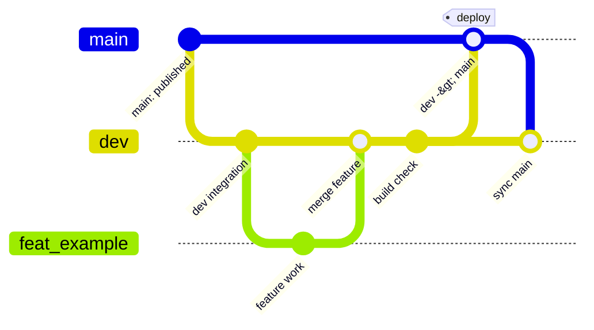

# KeycapMaker

A repository for a keycap design web app, deployed via GitHub Pages.

The current goal is to keep the existing implementation in a state where it can continue to be maintained and extended. The app itself, the SCAD assets, and the operational documentation are all kept self-contained within this repository.

## Start Here

- Documentation guide: [docs/README.md](docs/README.md)
- App overview: [docs/architecture/overview.md](docs/architecture/overview.md)
- SCAD / export contract: [docs/architecture/scad-and-export.md](docs/architecture/scad-and-export.md)
- Project data specification: [docs/architecture/project-data.md](docs/architecture/project-data.md)
- Development operations: [docs/guide/development.md](docs/guide/development.md)

## Supplementary Material

- Design source of truth: [docs/design/README.md](docs/design/README.md)
- Manual verification procedure: [docs/guide/manual-verification.md](docs/guide/manual-verification.md)
- Decision log: [docs/decisions/decision-log.md](docs/decisions/decision-log.md)
- Glossary: [docs/reference/glossary.md](docs/reference/glossary.md)
- Legend extensibility TODO: [docs/backlog/legend-extensibility-todo.md](docs/backlog/legend-extensibility-todo.md)

## Repository Assumptions

- The deployment target is GitHub Pages, so no server-side processing is assumed
- Dynamic processing runs entirely on the client side
- The OpenSCAD WASM runtime runs in the browser
- The preview path and the export path are kept as separate responsibilities
- The keycap body and the legend are kept as a structure that can be handled as separate volumes
- The current user-facing exports are `3MF`, `STEP` for CAD interchange, `STL` for single-color shapes, and `JSON` for resuming edits
- Color information is treated as auxiliary; the separate-volume approach is preferred for manufacturing-relevant meaning

## Directory Overview

- `src/`: implementation of the web app itself
- `public/`: static assets served as-is via GitHub Pages
- `scad/`: SCAD assets for keycap geometry
- `docs/`: implementation procedures, research material, and spec notes
- `.github/workflows/`: home for GitHub Actions and GitHub Pages deployment configuration

## Development

- Install dependencies: `npm install`
- Dev server: `npm run dev`
- Verify production build: `npm run build`
- Check build output: `npm run preview`

## Branch Operations

- `main`: the stable branch published to GitHub Pages. Do not delete
- `dev`: the integration branch for regular development. Do not delete
- `feat/*`: short-lived branches for individual work. Merge into `dev` as needed
- A GitHub Pages deployment runs only when `dev` is pushed / merged into `main` and there are changes to deployment-target paths
- Pushes to `dev` or `feat/*`, or pushes that only touch content unrelated to what's served on the web (such as `docs/`), do not trigger a deployment

## Deployment

- Workflow for GitHub Pages: [.github/workflows/deploy-pages.yml](.github/workflows/deploy-pages.yml)
- On first publish, you need to configure Pages usage on the GitHub side and confirm the published URL
