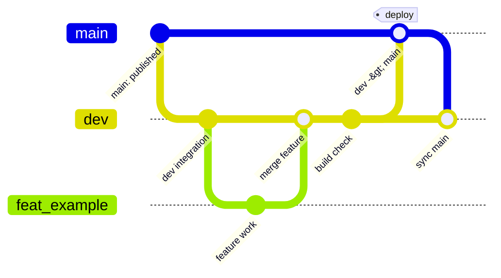

# KeycapMaker

This is a repository for a keycap editing web app delivered via GitHub Pages.

The current goal is to maintain the existing implementation in a state where it can continue to be maintained and expanded. The app itself, SCAD assets, and documents for actual operation are all contained within this repository.

## Documents to Read First

- Document Guide: [docs/README.md](docs/README.md)
- App Overview: [docs/architecture/overview.md](docs/architecture/overview.md)
- SCAD / Export Contract: [docs/architecture/scad-and-export.md](docs/architecture/scad-and-export.md)
- Project Data Specification: [docs/architecture/project-data.md](docs/architecture/project-data.md)
- Development Operations: [docs/guide/development.md](docs/guide/development.md)

## Supplementary Materials

- Design Source: [docs/design/README.md](docs/design/README.md)
- Manual Verification Procedure: [docs/guide/manual-verification.md](docs/guide/manual-verification.md)
- Decision Log: [docs/decisions/decision-log.md](docs/decisions/decision-log.md)
- Glossary: [docs/reference/glossary.md](docs/reference/glossary.md)
- Legend Extensibility TODO: [docs/backlog/legend-extensibility-todo.md](docs/backlog/legend-extensibility-todo.md)

## Repository Assumptions

- The deployment destination is GitHub Pages, so we do not assume server-side operations.
- Dynamic processing is executed on the client side.
- Run OpenSCAD WASM runtime inside the browser.
- Preview routes and export routes are separated in responsibility.
- Maintain a structure where the keycap body and the legend can be treated as separate volumes.
- Current exports for users are `3MF`, `STEP` for CAD exchange, `STL` for single-color shapes, and `JSON` for resuming editing.
- Color information is treated supplementarily, and manufacturing significance prioritizes separate volume.

## Directory Overview

- `src/`: Implementation of the web app itself
- `public/`: Static assets delivered as-is via GitHub Pages
- `scad/`: SCAD assets of keycap shapes
- `docs/`: Implementation procedures, research materials, specification memos
- `.github/workflows/`: Location of GitHub Actions and GitHub Pages deployment settings

## Development

- Install dependencies: `npm install`
- Development server: `npm run dev`
- Production build check: `npm run build`
- Check build artifacts: `npm run preview`

## Branch Operations

- `main`: Stable branch published to GitHub Pages. Do not delete.
- `dev`: Integration branch for regular development. Do not delete.
- `feat/*`: Short-term branch for individual work. Incorporate into `dev` as necessary.
- At the time of push / merge of the contents of `dev` to `main`, GitHub Pages deployment is executed only when there are changes in the deployment target paths.
- Deployments are not executed on push to `dev` or `feat/*`, or on push with only changes unrelated to web delivery resources such as `docs/`.

## Deployment

- Workflow for GitHub Pages: [.github/workflows/deploy-pages.yml](.github/workflows/deploy-pages.yml)
- Upon initial publication, GitHub requires confirmation of Pages usage settings and the public URL.
