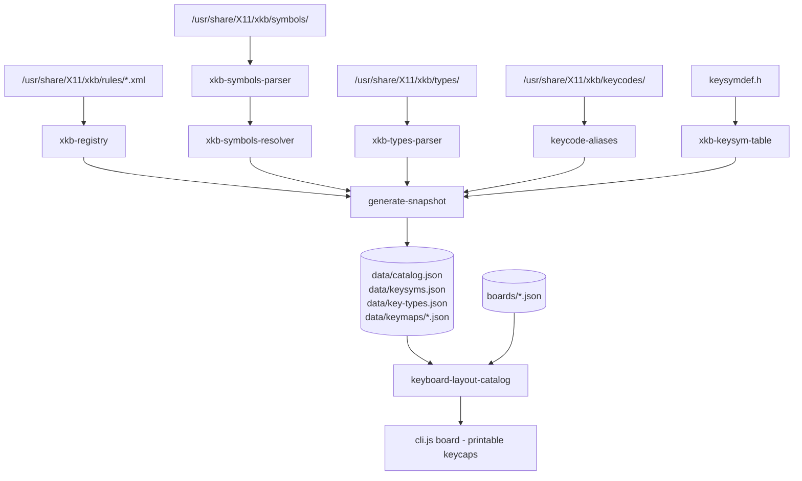

# Keyboard Layout Catalog

`tools/keyboard-layouts/` is a standalone Node tool that enumerates keyboard layout variations and resolves the legends that belong on each physical keycap. It exists so a keycap set can be modelled for a specific keyboard: you need to know which board you are printing (ANSI / ISO / JIS / ABNT), which keys that board has and how big each one is, and every label that belongs on each cap.

It is not part of the deployed bundle. Nothing in `src/` imports it, and the Vite build does not include it.

## Responsibilities

| Concern | Location |
| --- | --- |
| Locating xkeyboard-config, failing clearly when absent | `lib/xkb-source.js` |
| Layouts, variants, models, options from the rules XML | `lib/xkb-registry.js` |
| Tokenizing symbols files | `lib/xkb-symbols-parser.js` |
| Resolving `include` chains into one key map | `lib/xkb-symbols-resolver.js` |
| Naming the modifier behind each level | `lib/xkb-types-parser.js` |
| Choosing a key's type, explicitly or by inference | `lib/key-type-resolver.js` |
| Keysym to Unicode character or printed label | `lib/xkb-keysym-table.js`, `lib/keysym-legends.js` |
| Collapsing alias keycodes onto one physical key | `lib/keycode-aliases.js` |
| ANSI / ISO / JIS / ABNT classification | `lib/form-factor.js` |
| Mapping levels onto the five keycap slots | `lib/keycap-legends.js` |
| Physical board geometry (hand-authored) | `boards/*.json` |
| Rebuilding the committed snapshot | `generate-snapshot.js` |
| Reading the snapshot, in Node or a browser | `keyboard-layout-catalog.js` |

## Data flow

## Why the snapshot is committed

The source data is xkeyboard-config, which exists only on Linux systems that have it installed. The app is a static GitHub Pages site with no server-side processing, so a browser cannot run a generator. Committing the generated snapshot makes the tool work on macOS and Windows, and makes the data available to the app later without adding a build step.

`boards/` is hand-authored source and is never overwritten. `data/` is generated output and should only change by running `npm run layouts -- generate`. The generator writes to a staging directory and renames, and emits minified JSON with stable ordering, so regenerating on the same input produces byte-identical files.

## Snapshot contract

Every file carries `schemaVersion`, validated on load, throwing on mismatch — the same discipline as `editor-data.js` and `project-data.js`.

| File | Contents |
| --- | --- |
| `data/catalog.json` | counts, provenance, languages, countries, models, option groups, form factors, and every layout with its variants |
| `data/keysyms.json` | shared keysym → character or label table |
| `data/key-types.json` | shared key type → level names and modifiers |
| `data/keymaps/<layout>.json` | per layout, each variant's keys as `keycode → { type, levels }` |

Keymaps store keysym **names**, not characters; the shared keysym table resolves them. Non-base variants store only what differs from the layout's base variant (`inherits`, plus `removedKeys` where a key is dropped), which cuts the snapshot from 6.3 MB to 2.8 MB. The runtime module performs the merge.

## Level and modifier resolution

XKB expresses a key as an ordered list of keysyms; which modifier reaches which position is decided by the key's *type*, defined in `types/`. Those definitions carry the human names, so a level is reported as `AltGr` rather than `level 3` — read from the data, not hardcoded.

A key's type is chosen in this order: an explicit `type[group1]` on the key; the section's `key.type[group1]` default; otherwise inferred from the level count and whether levels form a lower/upper case pair. Inference is the common case — across the whole tree only 463 keys declare a type explicitly.

Only the first four levels are kept. Layouts that go deeper are truncated and flagged `truncatedLevels` with a `totalLevels` count.

## Keycap legend slots

`board` returns five slots per key, named to match the editor's existing keytop fields (`legend`, `topLegendLeftTop`, `topLegendRightTop`, `topLegendLeftBottom`, `topLegendRightBottom`): the centre carries a cased key's capital or a named key's label, and the four corners carry Base, Shift, AltGr and Shift+AltGr. This mapping is computed at read time rather than stored, so the convention can change without regenerating the snapshot.

## Deliberate limits

Group 1 only; four levels only; `modifier_map`, `virtual_modifiers` and `interpret` are ignored. Form factor uses symbol evidence first and the layout's primary country as a fallback, because a layout that does not redefine the key left of Z simply inherits it from `pc` — every entry records `formFactorSource` so a regional guess is visible as such. `tools/keyboard-layouts/README.md` documents these in full.
