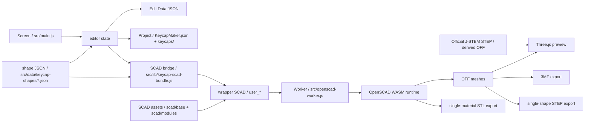

# App Overview

## Current Product Scope

KeycapMaker is a client-side only keycap editing app delivered via GitHub Pages. The current main features are as follows:

- Keycap shape editing
- Editing of legend string, typeface, in-font style, explicit thickness correction, position, and height. Top legend embed depth can also be edited.
- Homing bar and stem type switching
- Key rim addition exclusive to typewriter shape
- Preview using Three.js
- Projects to bundle multiple keycaps
- 3MF export
- STEP export for CAD exchange
- STL export for single-color shapes
- Saving and drag & drop loading of JSON for resuming editing

## Implementation Fixed Assumptions

- Use GitHub Pages for delivery
- Do not assume server-side processing
- Complete OpenSCAD execution, preview, and export within the browser
- Separate responsibilities for preview and export
- Maintain separate volume for body / legend
- Color specification is auxiliary information, and the significance of parts prioritizes the separate volume structure

## Main Responsibilities of the Code

### UI and State Management

- `src/main.js`
  Center of app state, form, preview update, export, and JSON input/output
- `src/lib/editor-data.js`
  Handles canonical export of edit data JSON and import of compatible input JSON supplementing missing parts with defaults
- `src/lib/project-data.js`
  Handles project manifest bundling multiple keycaps and normalization of project inner keycap entries
- `src/data/keycap-shape-registry.js`
  Aggregation of shape JSON, selector, and resolution of default shape
- `src/data/keycap-shapes/*.json`
  Initial values, geometry defaults, and display group definitions for each shape
- `src/lib/keycap-fonts.js`
  Shares legend font options and style resolution across UI / export / import

### OpenSCAD Execution

- `src/lib/openscad-client.js`
  Thin client for launching Web Worker
- `src/openscad-worker.js`
  Worker that executes OpenSCAD jobs using bundled runtime
- `public/vendor/openscad/`
  Bundled OpenSCAD WASM runtime

### SCAD Bridge

- `src/lib/keycap-scad-bundle.js`
  Bridge that passes SCAD files, fonts, and wrapper SCAD to runtime
- `scad/base/keycap.scad`
  Entry point for the entire keycap
- `scad/modules/`
  Reusable shapes such as shell, legend, stem, and homing bar
- `scad/presets/`
  SCAD-specific nominal constants and parameter sets for samples

### Preview and Export

- `src/lib/off-parser.js`
  Parser to handle OFF meshes in JS
- `src/lib/preview-scene.js`
  Preview display using Three.js
- `src/lib/export-3mf.js`
  Generates 3MF package from OFF meshes
- `src/lib/export-step.js`
  Generates STEP AP214 faceted B-rep from single-shape OFF mesh
- `public/assets/j-stem-lp01/`
  Official STEP of J-STEM-LP01 and official STEP-derived OFF mesh for reference preview

## Data Flow

1. UI input is held in state in `src/main.js`
2. `src/lib/keycap-scad-bundle.js` generates wrapper SCAD including `user_*` definitions
3. Worker executes SCAD in bundled OpenSCAD runtime
4. Preview parses OFF and passes it to Three.js display
5. In preview when J-STEM-LP01 is selected, official STEP-derived OFF is added as an alignment reference with color selection
6. Export generates 3MF by collecting OFF for each part, generates STEP from single-shape OFF, or generates single STL from OpenSCAD runtime. Edit data JSON is generated from state.
7. Project bundles multiple edit data JSONs and preview images with `KeycapMaker.json` manifest
8. Import reads project directory, saved edit data JSON, or sparse compatible input JSON, merges with defaults, and restores state

### Overall Flow Viewed with Mermaid

## Current User-facing Outputs

- `3MF`
  Holds body / rim / homing / top legend / sidewall legend meshes as part objects and bundles them in a components parent object.
- `STEP`
  Saves the single shape derived from `single_material_shape` as STEP AP214 faceted B-rep. Color, legend, and part separation are not included.
- `STL`
  Single-color shape output treated as an option. Saves as a single mesh without color and legend.
- `Edit Data JSON`
  Format to save UI state and reload it later.
- `Project`
  Directory format bundling multiple edit data JSONs and preview images with `KeycapMaker.json` manifest.

## Current Implementation Constraints

- Legends are fixed models of center / top right / bottom right / top left / bottom left on the keytop and sidewall front / back / left / right.
- The exposed surface of the top legend assumes top dish.
- Sidewall legends are placed matching the inclination of the center reference plane of each side, and automatically embedded up to the inner surface of the wall. They do not automatically track rounded corners or notched surfaces of JIS Enter.
- Variable font native styles can be used, but italic / slanted cannot be output unless the font has actual data.
- Color information in 3MF is added, but slicer compatibility requires separate manual verification.
- License confirmation for OpenSCAD runtime and bundled fonts requires human final confirmation.

## Related Materials

- [scad-and-export.md](scad-and-export.md)
- [project-data.md](project-data.md)
- [../guide/development.md](../guide/development.md)
- [../guide/manual-verification.md](../guide/manual-verification.md)
- [../backlog/legend-extensibility-todo.md](../backlog/legend-extensibility-todo.md)
