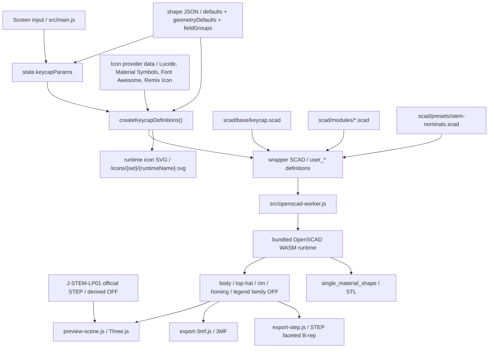

# SCAD / Export contract

## SCAD directory responsibilities

- `scad/base/`
  The whole-key entry point and export switching
- `scad/modules/`
  Reusable parts such as shell, legend, stem, and homing bar
- `scad/presets/`
  SCAD-specific nominal constants and sample parameter sets
- `scad/samples/`
  Samples used for shape regression checks

## Current keycap entry point

`scad/base/keycap.scad` is the current baseline entry point. `export_target` switches between the following.

- `preview`
- `body`
- `body_core`
- `top_hat`
- `rim`
- `homing`
- `legend`
- `top_legend_right_top`
- `top_legend_right_bottom`
- `top_legend_left_top`
- `top_legend_left_bottom`
- `side_legend_front`
- `side_legend_back`
- `side_legend_left`
- `side_legend_right`
- `single_material_shape`
- `j_stem_lp01_reference`

With this structure, the preview display and per-part export both work from the same base shape.

## Handling of separate volumes

- body / top-hat / rim / legend can each keep a separate volume
- The homing bar is treated as a tactile marker on the body side, and is not mixed with legend
- The relative positions of body / top-hat / rim / legend / homing are aligned to a shared origin
- Rather than relying on color alone, meshes themselves are split into parts

## Separation of responsibilities between preview and export

- preview:
  Prioritizes responsiveness and visual confirmation
- export:
  Prioritizes part separation and the semantic meaning of the shape

The current preview generates OFF meshes for body / top-hat / rim / homing / legend separately and passes them to Three.js. top-hat only becomes a separate OFF when the separate color option is enabled. On the Three.js side, indexed geometry that keeps shared vertices is used as the basis for creased normals, so curved surfaces stay smooth while sharp edges are preserved. The arc segmentation on the SCAD side is increased, up to a cap, based on each feature's radius and the `quality` setting. The current 3MF export assembles a 3MF from this same set of parts. STEP export outputs the `single_material_shape` target as an OFF and converts it to a STEP AP214 faceted B-rep on the browser side. STL export uses the OpenSCAD runtime's STL output directly from the `single_material_shape` target, treated as a single mesh that does not include color or legend.

legend's `text()` increases the curve segmentation count on the bundled OpenSCAD runtime according to the `quality` for preview / export, and internally scales up before scaling back down. This keeps rounded typeface outlines from becoming overly angular at small character sizes. A font's native style is specified by assembling a `font` query on the JS side; pseudo bold / italic / slanted without explicit user action is not performed. The underline is derived by reading `UnderlinePosition` / `UnderlineThickness` / the line-box center from the font file's `post` / `head` / `hhea` tables, converting them to text coordinates under `valign="center"`, and combining them with the measured character width. No arbitrary fallback is applied when font metadata cannot be obtained. Outline correction only applies `offset()` when explicitly requested via `legendOutlineDelta`.
legend has `text` and `icon` as content types. `text` uses a font and `text()` as before; `icon` injects the SVG of the selected icon provider as a runtime asset at `/icons/{iconSet}/{runtimeName}.svg`, and on the SCAD side the 2D shape is `import()`ed and turned into the legend volume via `linear_extrude()`. `legendIconSet` / `legendIconName` / `legendIconFill` are kept independent of font selection; if an existing JSON lacks the icon fields, `text` / `lucide` / `circle` / `false` are used as defaults. `legendIconFill` only takes effect when the selected icon has a filled body distinct from its normal body, and is resolved per provider: Material Symbols resolves between the outline shape and the base filled shape, and Remix Icon resolves between `*-line` and `*-fill`. At runtime in the browser, Lucide, Material Symbols, Font Awesome Free Solid, and Remix Icon are loaded from the `latest` package on jsDelivr, and the retrieved SVG node / body / path data is passed through a sanitizer before being turned into SVG for OpenSCAD. For Lucide, the sanitized node is further converted from stroke primitives into a filled path. When the CDN is unavailable, fallback data from the installed package is passed through the same sanitizer / conversion pipeline. For icons whose appearance doesn't change, `legendIconFill` is normalized to `false` and not shown in the UI. For icons, the stroke / fill shape ratio provided by each provider is preserved, and the `offset()` thickness correction from `legendOutlineDelta` is not applied. For icons as well, `legendSize`, `legendHeight`, position, and color are handled the same way as text, and no underline is produced. The current providers are Lucide, Material Symbols, Font Awesome Free Solid, and Remix Icon.
When a user adds a TTF / OTF, that font is kept in an in-browser temporary registry as `My Font`, and is injected as a runtime asset under `/fonts/user/` only during preview / export execution. The editor data JSON does not store the font body itself; it only keeps a `user-font:*` key derived from a hash of the file bytes. Re-adding the same font file produces a matching key, allowing it to be restored. An unresolved `user-font:*` is not silently replaced with a default font; instead, the UI prompts the user to re-add it.
The legend's character size is based directly on the UI's `legendSize`; there is no automatic shrinking based on character count, nor automatic enlargement for a single character.
legend's `legendHeight` treats 0 as flush with the surface; a positive value is treated as the height it rises above the surface, and a negative value as the depth it sinks into the surface as a recess. Even for a negative value, the legend part remains a separate volume, and the body side is displayed with the surface cut away down to the top of the recessed legend.
The legend's working area is not capped by the footprint of the keycap's top surface. Even if the text is too large, it is not automatically shrunk; the surface-fitting area on the SCAD side is made wide enough to allow the legend part to extend beyond the top surface of the key.
The volume that follows the curved surface for a top legend is treated as a band between the top surface and a copy of that surface translated downward. Whether the curve is a deep cylindrical / spherical concave dish or a high convex surface, the flat-plane-based working area is expanded on both the drop and rise sides of the curve, to avoid the legend part becoming empty.

## Bridging the UI to SCAD

Because `-D` overrides were not stable in the OpenSCAD browser runtime, a wrapper SCAD is generated on each run to inject `user_*` definitions.

Main bridge files:

- `src/lib/keycap-scad-bundle.js`
- `src/data/keycap-shape-registry.js`
- `src/data/keycap-shapes/*.json`
- `scad/presets/stem-nominals.scad`

The current keytop orientation parameters are based on `topCenterHeight`, with front-back normalized to `topPitchDeg` and left-right to `topRollDeg`. The UI also accepts edge-height input, but saving and the SCAD bridge both use this normalized representation.
`topOffsetX` / `topOffsetY` do not move the stem origin; they shift the center of the keytop's top face left-right / front-back. On the SCAD side, the same XY offset is passed to the body shell, rim, legend, homing bar, and the inner clearance for the stem clip, while the stem body itself stays at the origin.
For the custom shell, the top-face radius of the keytop is treated as `topCornerRadius` as a shared value; only when `topCornerRadiusIndividualEnabled` is enabled are `topCornerRadiusLeftTop` / `topCornerRadiusRightTop` / `topCornerRadiusRightBottom` / `topCornerRadiusLeftBottom` passed as `user_top_corner_radii`. The array order on the SCAD side is `[left_top, right_top, right_bottom, left_bottom]`.
The keytop shape switches between `flat` / `cylindrical` / `spherical` via `topSurfaceShape`. `dishDepth` is signed: a positive value is treated as the dish (recess) amount, and a negative value as the bulge (raised) amount; for both cylindrical and spherical the input range is clamped to `-1.5mm` to `+1.5mm`. The defaults remain `0.5mm` for cylindrical and `1.0mm` for spherical. The curve's starting position is fixed based on the top-face footprint; when the absolute value changes, only the Z direction of the existing sphere / cylinder is normalized, so positive and negative values are mirror images of the same curve. A convex surface is not cut off at the vertical wall of the nominal footprint; instead it is cut by an envelope that extends the sidewall slope upward, starting from the actual top-face boundary after rounding. This avoids deforming the central cylindrical / spherical curve while also avoiding an extra lip or flat step at the junction with the side faces. For a negative value, only the outside is raised, while the inner ceiling and the stem mounting height remain at the same position as with `flat`.
On the SCAD side, the dish is placed on the same coordinate transform as the top plane, so changing `topPitchDeg` / `topRollDeg` tilts the shape while preserving the local cylindrical / spherical geometry.
The shell shape's `topScale` is kept as a UI parameter, and is resolved on the JS bridge side into the final front-back and left-right angles based on the current `keyWidth` / `keyDepth` / `topCenterHeight` before being passed to SCAD. Because the top-face footprint targets `keyWidth * topScale` and `keyDepth * topScale`, a square key shrinks while keeping a square top face even when narrowed. The default value of `0.75` produces a top face of about 13.5mm for an 18mm 1u key. The lower bound is `0.02` in general, but for dimension conditions where the top-face footprint or inner clearance would collapse below 0.2mm, the JS side rounds up in 0.01 steps.
For custom shell and JIS Enter, `keycapEdgeRadius` is treated as a fillet applied only at the boundary between the keytop's top face and the sidewall. A value of 0 is the conventional sharp edge; a positive value keeps the existing shoulder generation while adding only a local roundover at the top edge. The convex envelope for `dishDepth` follows this actual top-face boundary after the roundover, and does not add any shape outside the fillet.
For custom shell and JIS Enter, `keycapShoulderRadius` applies to the shoulder cross-section that tapers from the bottom of the keycap body to the top face. A value of 0 is the conventional straight-line edge; a positive value is a shoulder that bulges outward in a round shape, and a negative value is a shoulder that sinks inward. The maximum absolute value is clamped to whichever is smaller of the actual horizontal taper determined by `topCenterHeight` and `topScale`.
For custom shell, `topHatEnabled` adds a second, smaller keytop on top of the top face. The top-hat is treated as part of the body shape by default, and is only split into a separate part under the `top_hat` target when `topHatSeparateColorEnabled` is enabled and `topHatHeight` is positive. Even in that case, it is unified with the rest under `single_material_shape`. `topHatColor` is used only as the color of the `top_hat` part in preview / 3MF. `topHatSurfaceShape` / `topHatDishDepth` / `topHatTopWidth` / `topHatTopDepth` / `topHatBottomWidth` / `topHatBottomDepth` / `topHatTopRadius` / `topHatBottomRadius` / `topHatHeight` / `topHatShoulderAngle` / `topHatShoulderRadius` are passed as `user_*`. `topHatSurfaceShape` is a `flat` / `cylindrical` / `spherical` selector for the top-hat's top surface independent of the regular `topSurfaceShape`, defaulting to `flat`. `topHatDishDepth` likewise treats positive as dish (recess) and negative as bulge (raised); for cylindrical / spherical it ranges from `-1.5mm` to `+1.5mm`, and is 0 for `flat`. `topHatTopWidth` / `topHatTopDepth` are the top-hat's top-face dimensions, and `topHatBottomWidth` / `topHatBottomDepth` are its bottom-face dimensions; the bottom dimensions are clamped to be at least the top dimensions and to stay within the parent keytop's top face. `topHatTopRadius` and `topHatBottomRadius` are treated separately as the radius of the top-hat's top face and bottom face respectively. Only when `topHatTopRadiusIndividualEnabled` is enabled are `topHatTopRadiusLeftTop` / `topHatTopRadiusRightTop` / `topHatTopRadiusRightBottom` / `topHatTopRadiusLeftBottom` passed as `user_top_hat_top_radii`, and only when `topHatBottomRadiusIndividualEnabled` is enabled are `topHatBottomRadiusLeftTop` / `topHatBottomRadiusRightTop` / `topHatBottomRadiusRightBottom` / `topHatBottomRadiusLeftBottom` passed as `user_top_hat_bottom_radii`. On the SCAD side, the array order for both is `[left_top, right_top, right_bottom, left_bottom]`. When `topHatHeight` is negative, the same shape is recessed from the top face, clamped to a depth that does not pierce through the shell ceiling. `topHatShoulderRadius` is a sharp edge at 0, rounds the shoulder's cross-section outward for positive values, and sinks it inward for negative values. The maximum absolute value is clamped to whichever is smaller of the actual shoulder height and width, meaning that at 45 degrees the cross-section viewed from the side can reach a quarter-circle shape. This is not yet exposed for typewriter-family shapes.
The JIS Enter shape is treated as the `jis_enter` geometry type. Its default is the commonly used tall Enter footprint of 1.5u x 2u with a 0.25u x 1u bottom-left notch, and the notch size can be edited via `jisEnterNotchWidth` / `jisEnterNotchDepth`. Since JIS X 6002 does not specify physical keytop dimensions, this shape is treated as a preset for the commonly used JIS / ISO family keycap footprint in practice. The typewriter-style JIS Enter uses the `typewriter_jis_enter` geometry type, applying the typewriter's thin top, rim, and reversed stem mount while using the same JIS footprint.
Per-shape initial values, geometry defaults, and display group configuration live in `src/data/keycap-shapes/*.json`, and the SCAD side has no fail-safe defaults for top-level user parameters. The JS bridge resolves all necessary values from the shape JSON and injects them as `user_*`.

The UI's `1u` conversion basis is treated as a display/input aid for checking narrow pitches. Changing the basis value does not change model dimensions such as `keyWidth` / `keyDepth`, and it is not passed to the SCAD bridge or the editor data JSON. Only when a `u`-based input is edited is it converted to mm using the current conversion basis and applied to the existing model parameters.

The typewriter shape's mounting height is held as `typewriterMountHeight`, treated as the distance from the center of the keycap body's top face to the bottom end of the stem. On the SCAD side, this is converted into the actual `stem_height` from `user_typewriter_mount_height` and `topCenterHeight`, so `topCenterHeight` (the keycap body's thickness) and `typewriterMountHeight` (the mounted height) can be adjusted independently.

The stem is first built as the nominal shape at the desired height, and then finally stopped by an `intersection()` with the keycap's internal clearance volume. This means that even with a strong `pitch / roll`, the stem automatically stops where it meets the underside of the keytop, following it more naturally than simple height capping would. Unlike a normal, positive-height stem, J-STEM-LP01 is applied as a subtractive recess for receiving the top of the LP01 plate, to the body shell / legend part / single material shape. The receiving recess is cut using only the outline of the LP01 plate at a nominal clearance of 0, leaving the area around the plate's round hole positions uncut on the underside of the keycap. On first switching to J-STEM-LP01, the UI's `stemCrossMargin` starts at 0.1mm based on physical fit-test results. If the physical fit is too tight, adjust in the positive direction; if too loose, adjust in the negative direction, in 0.02mm increments to the receiving recess's cut outline. legend is not disabled and keeps its separate volume; only the region overlapping the receiving recess is trimmed by the same recess. The app preview of the LP01 body displays the OFF derived from the official STEP in `public/assets/j-stem-lp01/` as a color-selectable alignment reference. Clear is shown semi-transparent, and white and orange are shown opaque; none of these are included in 3MF / STEP / STL. The SCAD-side `j_stem_lp01_reference` target and `j_stem_lp01_model()` remain as the legacy reference model.
The correspondence between the length labels on the J-STEM-LP01 drawing and the SCAD constants is summarized in [../reference/j-stem-lp01-dimensions.md](../reference/j-stem-lp01-dimensions.md).

### Screen -> JSON -> SCAD -> WASM flow as a Mermaid diagram



Rules:

- Additional UI parameters must update `src/main.js` and `src/lib/keycap-scad-bundle.js` together
- If the geometry contract changes, update `scad/base/` or `scad/modules/`
- Per-shape initial values and display groups are consolidated in shape JSON; SCAD accepts only explicit parameters

## Role of samples

- `scad/samples/keycap-1u.scad`
  For regression checks of the current keycap configuration
- `scad/samples/keycap-jis-enter.scad`
  For regression checks of the JIS / ISO family tall Enter footprint and the custom-shell-equivalent top-surface freedom
- `scad/samples/keycap-typewriter-jis-enter.scad`
  For regression checks of the typewriter-style JIS Enter footprint, rim, and mount position
- `scad/samples/keycap-typewriter-rim.scad`
  For checking separation of the key rim in the typewriter shape
- `scad/samples/keycap-typewriter-rim-tilted.scad`
  For regression checks of the typewriter key rim's joint with pitch / roll applied
- `scad/samples/keycap-typewriter-mount-height.scad`
  For checking the top-face-referenced mounting height of the typewriter shape
- `scad/samples/keycap-typewriter-spherical-top.scad`
  For regression checks of whether a spherical top breaks in the typewriter shape
- `scad/samples/keycap-legend-seat.scad`
  For checking the flush legend seat cutout
- `scad/samples/keycap-curved-legend-seat.scad`
  For regression checks of whether the body overlaps the legend surface on a spherical top
- `scad/samples/keycap-multi-character-legend.scad`
  For regression checks that multi-character legends keep the explicit size without automatic shrinking
- `scad/samples/keycap-top-legends.scad`
  For checking top legend placement at center / top-right / bottom-right / top-left / bottom-left
- `scad/samples/keycap-rounded-legend.scad`
  For regression checks of legend outline quality with a rounded typeface
- `scad/samples/keycap-sidewall-legend.scad`
  For checking sidewall legend placement on front / back / left / right
- `scad/samples/keycap-homing-bar.scad`
  For standalone checks of the homing bar
- `scad/samples/keycap-stem-clip.scad`
  For regression checks that the stem tip stops along the internal ceiling under strong left-right tilt
- `scad/samples/keycap-j-stem-lp01.scad`
  For checking the underside cutout of the J-STEM-LP01 receiving recess
- `scad/samples/keycap-surface-quality.scad`
  For regression checks combining rounded-corner outline, dish, and stem-perimeter surface quality
- `scad/samples/keycap-convex-surfaces.scad`
  For regression checks of negative `dishDepth` (cylindrical / spherical) on a 1u key, a wide key, top-edge radius, and JIS Enter
- `scad/samples/keycap-top-corner-radii.scad`
  For regression checks of individually specified radii on the custom shell's four top corners
- `scad/samples/keycap-top-orientation.scad`
  For regression checks of fixed top-center height plus pitch / roll
- `scad/samples/keycap-top-offset.scad`
  For checking the keytop-center XY offset with the stem origin fixed
- `scad/samples/keycap-top-edge-rounded.scad`
  For checking the custom shell's keytop top-edge radius
- `scad/samples/keycap-shoulder-rounded.scad`
  For checking the custom shell's body shoulder radius
- `scad/samples/keycap-shoulder-rounded-hollow.scad`
  For checking the custom shell's rounded shoulder following the interior hollow
- `scad/samples/keycap-shoulder-concave.scad`
  For checking the custom shell's negative body shoulder radius
- `scad/samples/keycap-top-hat.scad`
  For checking the custom shell's top-hat keytop
- `scad/samples/keycap-top-hat-separated.scad`
  For checking the custom shell's top-hat as a separate-part target
- `scad/samples/keycap-top-hat-spherical.scad`
  For checking the custom shell's spherical top-hat top face
- `scad/samples/keycap-top-hat-top-radii.scad`
  For regression checks of individually specified radii on the custom shell's top-hat top four corners
- `scad/samples/keycap-top-hat-recess.scad`
  For checking the custom shell's negative-height top-hat recess
- `scad/samples/stem-mounts.scad`
  For checking differences between stem mounts

Samples are currently used for geometry regression.

## Current export contract

### 3MF

- The source is OFF meshes
- Within the 3MF, object resources are split per part
- Rather than laying parts side by side, `build` contains exactly one parent object bundling the body / top-hat / rim / homing / legend family parts as `components`
- The parent object's `name` uses the UI's `name` field
- The current candidate parts are `body`, `top-hat`, `rim`, `homing`, `legend`, `legend-left-top`, `legend-right-top`, `legend-left-bottom`, `legend-right-bottom`, `legend-front`, `legend-back`, `legend-left`, `legend-right`
- If top-hat separate color is disabled, or the top-hat is a recessed shape, the `top-hat` object is not included
- If the keytop legend is disabled, the corresponding `legend*` object is not included
- If the sidewall legend is disabled, the corresponding `legend-*` object is not included
- Both text legends and icon legends are treated as `legend*` objects, preserving part separation and color assignment in the 3MF
- If the typewriter key rim is disabled, the rim object is not included
- If the homing bar is disabled, the homing object is not included
- The parent object has no material / color of its own; the child part objects' material / color are preserved
- For Bambu Studio / OrcaSlicer, `Metadata/model_settings.config` is added; for PrusaSlicer / Slic3r PE, `Metadata/Slic3r_PE_model.config` is added, keeping part display names as `body` / `rim` / `homing` / `legend` / `legend-*`
- For importers centered on standard 3MF, such as Cura, the child objects' `name` and `partnumber` are preserved

### STEP

- The source is the OFF mesh of the `single_material_shape` target
- Since the bundled OpenSCAD runtime does not support native STEP export, it is generated on the browser side as STEP AP214's `FACETED_BREP_SHAPE_REPRESENTATION`
- The body shell, top-hat, stem, homing bar, and typewriter rim are treated as a single shape
- legend is not included in the output
- Color, material, part names, and separate-volume information are not included
- Because the curved surface represents the faceted mesh generated by OpenSCAD as `POLY_LOOP` / `FACE_SURFACE`, this is suitable for CAD interchange but is not a parametric NURBS / analytic surface
- Use 3MF if color separation or legend is needed
- As with the other exports, the download filename is based on `params.name`

### STL

- The source is the `single_material_shape` target
- Output directly as binary STL from the OpenSCAD runtime
- The body shell, top-hat, stem, homing bar, and typewriter rim are unioned into a single mesh
- legend is not included in the output
- Color, material, part names, and separate-volume information are not included
- Use 3MF if color separation or legend is needed
- As with JSON / 3MF / STEP, the download filename is based on `params.name`

### Editor data JSON

- Used for saving and reloading UI state
- The canonical JSON for saving carries a `schemaVersion`
- The saved name is included in `params.name`
- Treated as a resume-work format rather than a geometry export
- The download filename for JSON / 3MF / STEP / STL is based on `params.name`
- When saving, the full configuration with shape defaults resolved is kept, without dropping values from inactive UI fields
- When loading, both canonical JSON and sparse compatible input JSON are accepted
- Compatible input JSON can specify known parameters either under `params` or at the top level. Missing keys use the shape defaults
- If `shapeProfile` is explicitly specified, binding is based on that profile's defaults; if unspecified, the default profile is used
- Unknown keys are ignored, and only known keys are sanitized and applied to state

Minimal example of compatible input JSON:

```json
{
  "shapeProfile": "typewriter",
  "legendText": "ESC",
  "rimEnabled": false
}
```

In the example above, unspecified values such as `rimWidth` and `legendColor` are filled in from the typewriter shape JSON defaults, to restore the final editor state.

## Current known constraints

- legend uses a fixed model of center / top-right / bottom-right / top-left / bottom-left on the keytop, and front / back / left / right on the sidewall
- The keytop legend's exposed face assumes a top dish
- The sidewall legend is placed to match the tilt of each side's center reference plane, and is automatically embedded up to the wall's inner surface. It does not automatically follow rounded corners or the notch face of JIS Enter
- Font assets may mix variable and static fonts, but the availability of native styles varies by font
- User-added TTF / OTF fonts are treated as in-browser "My Font" entries, and the font body itself is not bundled into JSON / project ZIP
- An additional quality tier such as `high_preview` has not been adopted. If it becomes necessary, revisit starting from [../backlog/high-preview-quality-mode.md](../backlog/high-preview-quality-mode.md)

These extension TODOs are collected in [../backlog/legend-extensibility-todo.md](../backlog/legend-extensibility-todo.md).

## Update rules

- Update this document whenever the SCAD responsibility boundaries change
- Update this document and the manual verification procedure whenever the export part contract changes
- Record adoption decisions in [../decisions/decision-log.md](../decisions/decision-log.md)
</content>
</invoke>
