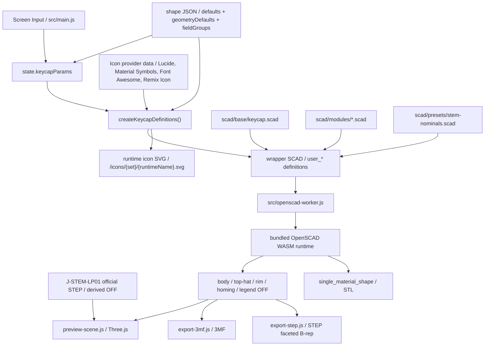

# SCAD and Export Contract

## SCAD Directory Responsibilities

- `scad/base/`
  Whole-key entry point and export switching
- `scad/modules/`
  Reusable parts such as shell, legend, stem, and homing bar
- `scad/presets/`
  SCAD-specific nominal constants and parameter sets for samples
- `scad/samples/`
  Samples used for shape regression checks

## Current Keycap Entry

`scad/base/keycap.scad` is the current base entry. The following are switched by `export_target`:

- `preview`
- `body`
- `body_core`
- `top_hat`
- `rim`
- `homing`
- `legend`
- `top_legend_right_top`
- `top_legend_right_bottom`
- `top_legend_left_top`
- `top_legend_left_bottom`
- `side_legend_front`
- `side_legend_back`
- `side_legend_left`
- `side_legend_right`
- `single_material_shape`
- `j_stem_lp01_reference`

For `export_target = preview`, all parts are evaluated and returned with `#` prefix if they have colors, passing the visual properties. For other targets, only the specified body part is output in a color-independent format.
`top_hat` is the separate part when the custom shell's top-hat keycap is enabled and the separation color is active. If the top-hat color is the same as the body, or if the top-hat is recessed instead of raised, it is not treated as a separate part, and `body` combines them.
`body_core` is the body volume without the `homing` geometry, primarily used to output the homing bar correctly via 3MF part separation.

Parameters (`user_*`) passed from JS to SCAD separate strings and numbers cleanly. In JS, UI variables include `mm` / `deg`, but these are stripped and passed as numeric values to SCAD parameters. For strings, they are passed properly escaped via `-D`. The JS bridge generates a `wrapper.scad` string where `user_*` values are injected into OpenSCAD's `keycap.scad`, and the worker evaluates this. The `quality` switch is determined by the JS side, passing `preview` or `export` to `user_quality`.

Shell generation (`scad/modules/keycap_shell.scad`) adds a dish indentation based on the `topCenterHeight` baseline in addition to outer perimeter tapering and curvature tracking based on `pitch` / `roll`. If it is a typewriter shape and the key rim is enabled, it returns the body with a flush seat for the rim subtracted.
The `topSurfaceShape` switches between `flat`, `cylindrical`, and `spherical`. If it is `flat`, the `dishDepth` is ignored. If it is `cylindrical` or `spherical`, a dish is generated. The `topHatSurfaceShape` applied to the top surface of the top-hat follows the same specification.
If `dishDepth` is negative, it treats it as a bulge that is a mirror image of the convex surface, and the convex surface starts from the actual top boundary after rounding and is cut by an envelope extending the existing sidewall gradient upwards. It does not lift the inner ceiling or stem mounting height.
For custom shell, `topHatEnabled` switches the top-hat keycap. `topHatHeight` specifies the height from the normal top surface. `topHatSizeXY` specifies the difference relative to the normal top surface footprint. `topHatTopRadius` is treated separately as the top surface radius of the top-hat, and `topHatBottomRadius` as the bottom surface radius of the top-hat. Only when `topHatTopRadiusIndividualEnabled` is enabled, `topHatTopRadiusLeftTop` / `topHatTopRadiusRightTop` / `topHatTopRadiusRightBottom` / `topHatTopRadiusLeftBottom` are passed as `user_top_hat_top_radii`, and only when `topHatBottomRadiusIndividualEnabled` is enabled, `topHatBottomRadiusLeftTop` / `topHatBottomRadiusRightTop` / `topHatBottomRadiusRightBottom` / `topHatBottomRadiusLeftBottom` are passed as `user_top_hat_bottom_radii`. The array order on the SCAD side for both is `[left_top, right_top, right_bottom, left_bottom]`. If `topHatHeight` is negative, the same shape is recessed from the top surface and rounded to a depth that does not penetrate the shell ceiling. `topHatShoulderRadius` is 0 for a sharp edge, a positive value rounds the cross-section of the shoulder, and a negative value recesses it. Because the maximum absolute value is rounded to the smaller of the actual shoulder height and width, it can be specified up to where the cross-section viewed from the side becomes a 1/4 circular shape at 45 degrees. This is not yet displayed for typewriter styles.
The JIS Enter shape is treated as a `jis_enter` geometry type. The default values are a generally vertical Enter footprint of 1.5u x 2u, with a bottom-left notch of 0.25u x 1u, and the notch amount can be edited with `jisEnterNotchWidth` / `jisEnterNotchDepth`. Since JIS X 6002 does not specify physical keytop dimensions, this shape is treated as a preset for JIS / ISO style keycap footprints often used in practice. The typewriter style JIS Enter is defined as a `typewriter_jis_enter` geometry type, using the same JIS footprint while applying the thin top, rim, and reverse stem mount of the typewriter.
Initial values, geometry defaults, and display group configurations for each shape are located in `src/data/keycap-shapes/*.json`, and the SCAD side does not hold fail-safe defaults for top-level user parameters. The JS bridge resolves all necessary values from the shape JSON and injects them as `user_*`.

The UI's `1u` conversion standard is treated as a display and input aid for narrow pitch verification. Changing the standard value does not change model dimensions like `keyWidth` / `keyDepth`, nor does it pass them to the SCAD bridge or edit data JSON. Only when the input on the `u` side is edited, it is converted to mm dimensions using the current conversion standard and reflected in the existing model parameters.

The mounting height of the typewriter shape is held in `typewriterMountHeight` and treated as the distance from the center of the top surface of the keycap body to the bottom edge of the stem. Since the SCAD side converts `user_typewriter_mount_height` and `topCenterHeight` into the actual `stem_height`, `topCenterHeight` can be adjusted as the thickness of the keycap body, and `typewriterMountHeight` as the height when mounted, independently.

The stem creates the nominal shape of the desired height first, and finally uses `intersection()` with the keycap's internal clearance volume to limit it. This ensures that even with a strong `pitch / roll`, the stem automatically stops at the position hitting the back of the keycap, tracking more naturally than simple height suppression. J-STEM-LP01 is applied as a subtraction recess for receiving the LP01 top surface to the body shell / legend part / single material shape, rather than as a normal positive stem. The socket recess carves only the outer shape of the LP01 plate with 0 nominal clearance, leaving the round hole positions inside the plate without carving the back of the keycap. When switching to J-STEM-LP01 for the first time, start the UI's `stemCrossMargin` at 0.1mm based on actual physical confirmation results. If the actual part is tight, adjust the carved outer shape of the socket in 0.02mm increments in the positive direction; if loose, adjust in the negative direction. The legend is not disabled but maintains a separate volume, and only the area overlapping the socket is trimmed with the same recess. The app preview of the LP01 body displays the official STEP-derived OFF from `public/assets/j-stem-lp01/` as an alignment reference with color selection. Clear is displayed as translucent, white and orange as opaque, and it is not included in 3MF / STEP / STL. The `j_stem_lp01_reference` target and `j_stem_lp01_model()` on the SCAD side are retained as old reference models.
The correspondence between the length labels on the J-STEM-LP01 drawing and SCAD constants is summarized in [../reference/j-stem-lp01-dimensions.md](../reference/j-stem-lp01-dimensions.md).

### Flow of Screen JSON SCAD WASM in Mermaid



Rules:

- When adding UI parameters, update both `src/main.js` and `src/lib/keycap-scad-bundle.js` at the same time.
- When the geometry contract changes, update `scad/base/` or `scad/modules/`.
- Initial values and display groups for each shape are consolidated in shape JSON, and SCAD receives only explicit parameters.

## Purpose of Samples

- `scad/samples/keycap-1u.scad`
  For regression checks of the current keycap configuration.
- `scad/samples/keycap-jis-enter.scad`
  For regression checks of the vertically long JIS / ISO Enter footprint and custom shell top surface degrees of freedom.
- `scad/samples/keycap-typewriter-jis-enter.scad`
  For regression checks of the typewriter style JIS Enter footprint, rim, and mount positions.
- `scad/samples/keycap-typewriter-rim.scad`
  For checking key rim separation of typewriter shape.
- `scad/samples/keycap-typewriter-rim-tilted.scad`
  For checking joint of typewriter key rim with pitch / roll.
- `scad/samples/keycap-typewriter-mount-height.scad`
  For checking mounting height based on typewriter shape top surface.
- `scad/samples/keycap-typewriter-spherical-top.scad`
  For regression checks that spherical top does not break in typewriter shape.
- `scad/samples/keycap-legend-seat.scad`
  For checking flush legend seat cutout.
- `scad/samples/keycap-curved-legend-seat.scad`
  For regression checks that body does not cover legend surface even on spherical top.
- `scad/samples/keycap-multi-character-legend.scad`
  For regression checks that it does not auto-shrink even with multiple characters, keeping explicit size.
- `scad/samples/keycap-top-legends.scad`
  For checking center / top right / bottom right / top left / bottom left legend placement on the keycap top.
- `scad/samples/keycap-rounded-legend.scad`
  For regression checks of legend contour quality with rounded fonts.
- `scad/samples/keycap-sidewall-legend.scad`
  For checking front / back / left / right sidewall legend placement.
- `scad/samples/keycap-homing-bar.scad`
  For checking homing bar individually.
- `scad/samples/keycap-stem-clip.scad`
  For regression checks that stem top end stops along inner ceiling with strong left/right tilt.
- `scad/samples/keycap-j-stem-lp01.scad`
  For checking backside carving of J-STEM-LP01 socket.
- `scad/samples/keycap-surface-quality.scad`
  For regression checks evaluating surface quality of rounded corners, dish, and stem outer circumference together.
- `scad/samples/keycap-convex-surfaces.scad`
  For regression checks evaluating negative `dishDepth` for cylindrical/spherical shapes on 1u, wide keys, top edge radii, and JIS Enter.
- `scad/samples/keycap-top-corner-radii.scad`
  For regression checks of individual specifications for 4 corner radii on custom shell top surface.
- `scad/samples/keycap-top-orientation.scad`
  For regression checks of fixed top center height + pitch / roll.
- `scad/samples/keycap-top-offset.scad`
  For checking XY offset of keycap center while keeping stem origin fixed.
- `scad/samples/keycap-top-edge-rounded.scad`
  For checking custom shell keycap top edge radii.
- `scad/samples/keycap-shoulder-rounded.scad`
  For checking body shoulder radius of custom shell.
- `scad/samples/keycap-shoulder-rounded-hollow.scad`
  For checking tracking of rounded shoulder and inner hollow in custom shell.
- `scad/samples/keycap-shoulder-concave.scad`
  For checking negative body shoulder radius of custom shell.
- `scad/samples/keycap-top-hat.scad`
  For checking top-hat keycap of custom shell.
- `scad/samples/keycap-top-hat-separated.scad`
  For checking separate part target of top-hat in custom shell.
- `scad/samples/keycap-top-hat-spherical.scad`
  For checking spherical top-hat top surface of custom shell.
- `scad/samples/keycap-top-hat-top-radii.scad`
  For regression checks of individual specifications of top-hat top surface 4 corner radii in custom shell.
- `scad/samples/keycap-top-hat-recess.scad`
  For checking negative height top-hat recess of custom shell.
- `scad/samples/stem-mounts.scad`
  For checking stem mount differences.

Samples are currently used for geometry regression checks.

## Current Export Contract

### 3MF

- Source is OFF mesh
- Object resources are separated for each part within 3MF
- In `build`, instead of placing parts sequentially, parts related to body / top-hat / rim / homing / legend are bundled as a parent object using `components`, and only one parent object is placed
- Parent object `name` uses `Name` from UI
- Current candidate parts are `body`, `top-hat`, `rim`, `homing`, `legend`, `legend-left-top`, `legend-right-top`, `legend-left-bottom`, `legend-right-bottom`, `legend-front`, `legend-back`, `legend-left`, `legend-right`
- If top-hat separation color is disabled or top-hat is recessed, `top-hat` object is not included
- If top legend is disabled, the corresponding `legend*` objects are not included
- If sidewall legend is disabled, the corresponding `legend-*` objects are not included
- Both text legends and icon legends are treated as `legend*` objects, maintaining part separation and color specification in 3MF
- If typewriter key rim is disabled, rim object is not included
- If homing bar is disabled, homing object is not included
- Parent object does not have material/color; child part objects retain their material/color
- Adds `Metadata/model_settings.config` for Bambu Studio/OrcaSlicer, and `Metadata/Slic3r_PE_model.config` for PrusaSlicer/Slic3r PE, retaining part display names as `body` / `rim` / `homing` / `legend` / `legend-*`
- Maintains child object `name` and `partnumber` for standard 3MF-oriented importers like Cura

### STEP

- Source is OFF mesh of `single_material_shape` target
- Since bundled OpenSCAD runtime doesn't support native STEP export, browser generates it as `FACETED_BREP_SHAPE_REPRESENTATION` of STEP AP214
- Body shell, top-hat, stem, homing bar, and typewriter rim are treated as a single shape
- Legends are not included in the output
- Color, material, part name, and separate volume information are not included
- Curved surfaces represent faceted mesh generated by OpenSCAD as `POLY_LOOP` / `FACE_SURFACE`. Though for CAD exchange, it's not a parametric NURBS / analytic surface
- Use 3MF if color separation or legend is needed
- As with other exports, download file name is based on `params.name`

### STL

- Source is `single_material_shape` target
- Exported directly as binary STL from OpenSCAD runtime
- Body shell, top-hat, stem, homing bar, and typewriter rim are combined (union) into a single mesh
- Legends are not included in the output
- Color, material, part name, and separate volume information are not included
- Use 3MF if color separation or legend is needed
- As with JSON / 3MF / STEP, download file name is based on `params.name`

### Edit Data JSON

- For saving and reloading UI state
- Canonical JSON for saving has `schemaVersion`
- Includes save name in `params.name`
- Treated as a format for resuming work, not geometry export
- JSON / 3MF / STEP / STL download file names are based on `params.name`
- When saving, it holds full configuration resolving shape defaults, without dropping values for disabled UI inputs
- When loading, accepts sparse compatible input JSON in addition to canonical JSON
- Compatible input JSON can have known parameters under `params` or top-level. Missing keys fall back to shape defaults
- If `shapeProfile` is explicit, binds relative to its defaults; if unspecified, uses default profile
- Ignores unknown keys and sanitizes only known keys to reflect in state

Minimal example of compatible input JSON:

```json
{
  "shapeProfile": "typewriter",
  "legendText": "ESC",
  "rimEnabled": false
}
```

In the example above, unspecified values like `rimWidth` or `legendColor` are populated with typewriter shape JSON defaults before restoring the final editor state.

## Current Known Constraints

- Legends are fixed models of center / top right / bottom right / top left / bottom left on the keytop and sidewall front / back / left / right
- Top legend exposure assumes top dish
- Sidewall legends align with the inclination of the center reference plane of each side, and embed automatically up to the inner surface of the wall. They do not automatically track rounded corners or notched surfaces of JIS Enter
- Font assets allow a mix of variable / static, but the availability of native styles varies per font
- User-added TTF / OTF are treated as local browser fonts, and the font files are not bundled in JSON / project ZIP
- Additional quality levels like `high_preview` are not yet adopted. Re-evaluate from `docs/backlog/high-preview-quality-mode.md` if needed

These extension TODOs are documented in `docs/backlog/legend-extensibility-todo.md`.

## Update Rules

- Update this document when SCAD responsibility boundaries change
- Update this document and the manual verification procedure when the export part contract changes
- Leave adoption decisions in `docs/decisions/decision-log.md`
