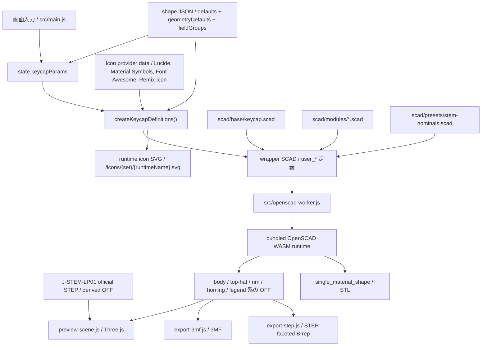

# SCAD / Export 契約

## SCAD ディレクトリの責務

- `scad/base/`
  whole-key のエントリポイントと export 切り替え
- `scad/modules/`
  shell、legend、stem、homing bar などの再利用部品
- `scad/presets/`
  SCAD 固有の nominal constant や sample 用 parameter set
- `scad/samples/`
  形状回帰確認に使うサンプル

## 現在のキーキャップエントリ

`scad/base/keycap.scad` が現在の基準エントリです。`export_target` で次を切り替えます。

- `preview`
- `body`
- `body_core`
- `top_hat`
- `rim`
- `homing`
- `legend`
- `top_legend_right_top`
- `top_legend_right_bottom`
- `top_legend_left_top`
- `top_legend_left_bottom`
- `side_legend_front`
- `side_legend_back`
- `side_legend_left`
- `side_legend_right`
- `single_material_shape`
- `j_stem_lp01_reference`

この構成により、preview 用表示と part 単位 export を同じ基礎形状から扱います。

## separate volume の扱い

- body / top-hat / rim / legend は別体積を維持できる
- homing bar は body 側の触覚マーカーとして扱い、legend と混ぜない
- body / top-hat / rim / legend / homing の相対位置は共有原点で揃える
- 色だけに依存せず、mesh 自体を part として分ける

## preview と export の責務分離

- preview:
  反応速度と見た目確認を優先する
- export:
  part 分離と形状の意味づけを優先する

現在の preview は OFF メッシュを body / top-hat / rim / homing / legend ごとに生成して Three.js へ渡します。top-hat は分離色が有効な場合だけ別 OFF になる。Three.js 側では shared vertex を保った indexed geometry を基準に creased normals を作り、曲面は滑らかに、急角は残す。SCAD 側の円弧分割は feature の半径と `quality` に応じて上限付きで増やす。現在の 3MF export は同じ part 群から 3MF を組み立てます。STEP export は `single_material_shape` target を OFF として出力し、ブラウザ側で STEP AP214 faceted B-rep へ変換します。STL export は `single_material_shape` target から OpenSCAD runtime の STL 出力を直接使い、色と legend を含まない単一メッシュとして扱います。

legend の `text()` は bundled OpenSCAD runtime 上で preview / export の `quality` に応じて曲線分割数を上げ、内部では拡大してから縮小する。これにより、小さい文字サイズでも丸みのある書体の輪郭が過度に角張るのを抑える。font の native style は JS 側で `font` query を組み立てて指定し、ユーザー操作なしの擬似 bold / italic / slanted は行わない。下線は font file の `post` / `head` / `hhea` から `UnderlinePosition` / `UnderlineThickness` / line box 中心を読み、`valign="center"` な text 座標へ変換したうえで実測文字幅と組み合わせる。font metadata を取れない場合の任意フォールバックは行わない。輪郭補正は `legendOutlineDelta` を通した明示入力時だけ `offset()` を使う。
legend は content type として `text` と `icon` を持つ。`text` は従来どおり font と `text()` を使い、`icon` は選択した icon provider の SVG を runtime asset として `/icons/{iconSet}/{runtimeName}.svg` に注入し、SCAD 側で `import()` した 2D 形状を `linear_extrude()` して legend volume にする。font 選択とは独立して `legendIconSet` / `legendIconName` / `legendIconFill` を保持し、既存 JSON に icon 用フィールドがない場合は `text` / `lucide` / `circle` / `false` を補完する。`legendIconFill` は選択した icon が通常 body とは異なる filled body を持つ場合だけ有効になり、Material Symbols は outline shape と base filled shape、Remix Icon は `*-line` と `*-fill` へ provider ごとに解決する。ブラウザ実行時は Lucide、Material Symbols、Font Awesome Free Solid、Remix Icon を jsDelivr の `latest` package から読み込み、取得した SVG node / body / path data を sanitizer に通してから OpenSCAD 用 SVG を作る。Lucide は sanitizer 済み node をさらに stroke primitives から filled path へ変換する。CDN が利用できない場合は installed package 由来の fallback data を同じ sanitizer / 変換経路に通す。見た目が変わらない icon では `legendIconFill` を `false` に丸め、UI も表示しない。アイコンでは provider が持つ stroke / fill の形状比率を維持し、`legendOutlineDelta` による `offset()` 太さ補正は適用しない。アイコンでも `legendSize`、`legendHeight`、位置、色は共通に扱い、下線は出さない。現在の provider は Lucide、Material Symbols、Font Awesome Free Solid、Remix Icon。
ユーザーが TTF / OTF を追加した場合、その font はブラウザ内の一時 registry に `マイフォント` として保持し、preview / export 実行時だけ runtime asset として `/fonts/user/` 配下へ注入する。編集データ JSON には font 本体を保存せず、file bytes の hash 由来の `user-font:*` key だけを保持する。同じ font file を再追加すると key が一致して復元できる。未読み込みの `user-font:*` は既定 font へ黙って置換せず、UI で再追加を促す。
legend の文字サイズは UI の `legendSize` をそのまま基準にし、文字数に応じた自動縮小や単一文字だけの自動拡大は行わない。
legend の `legendHeight` は 0 を面一とし、正値は表面から盛り上がる高さ、負値は表面から沈み込む recess 深さとして扱う。負値の場合も legend part は別体積のまま保持し、body 側は表面から recessed legend の上面までを切り抜いて表示する。
legend の作業領域はキーキャップ上面の footprint を上限にしない。文字が大きすぎる場合も自動縮小せず、SCAD 側の surface fitting 用領域を十分広く取って、legend part がキー上面からはみ出すことを許可する。
top legend の曲面追従 volume は、上面曲面とその下側へ平行移動した曲面の間の band として扱う。cylindrical / spherical の深い凹面でも高い凸面でも、平面基準の作業領域を曲面の drop / rise の両側へ広げ、legend part が空になることを避ける。

## UI から SCAD への橋渡し

OpenSCAD browser runtime では `-D` 上書きが安定しなかったため、実行ごとに wrapper SCAD を生成して `user_*` 定義を注入します。

主な橋渡しファイル:

- `src/lib/keycap-scad-bundle.js`
- `src/data/keycap-shape-registry.js`
- `src/data/keycap-shapes/*.json`
- `scad/presets/stem-nominals.scad`

現在のキートップ姿勢パラメータは `topCenterHeight` を基準にし、前後は `topPitchDeg`、左右は `topRollDeg` へ正規化する。UI では端高さ入力も使えるが、保存と SCAD bridge はこの正規化表現を使う。
`topOffsetX` / `topOffsetY` は stem 原点を動かさず、キートップ上面側の中心を左右 / 前後にずらす。SCAD 側では body shell、rim、legend、homing bar と stem clip 用の内側 clearance へ同じ XY offset を渡し、stem 本体は原点に残す。
custom shell のキートップ上面Rは `topCornerRadius` を共通値として扱い、`topCornerRadiusIndividualEnabled` が有効な場合だけ `topCornerRadiusLeftTop` / `topCornerRadiusRightTop` / `topCornerRadiusRightBottom` / `topCornerRadiusLeftBottom` を `user_top_corner_radii` として渡す。SCAD 側の配列順は `[left_top, right_top, right_bottom, left_bottom]`。
キートップ形状は `topSurfaceShape` で `flat` / `cylindrical` / `spherical` を切り替える。`dishDepth` は符号付きで、正値を凹み量、負値を盛り上がり量として扱い、cylindrical / spherical とも入力範囲を `-1.5mm` から `+1.5mm` に丸める。既定値は cylindrical が `0.5mm`、spherical が `1.0mm` のまま維持する。曲面の開始位置は上面 footprint 基準で固定し、絶対値の変更時は既存の球 / 円柱の Z 方向だけを正規化するため、正負は同じ曲面の鏡像になる。凸面は nominal footprint の垂直壁で切らず、丸め後の実際の上面境界を起点としてサイドウォール勾配を上方へ延長した envelope で切る。これにより、中央の cylindrical / spherical 曲面を変形させず、側面との接続部に余分なリップや平面段差を作らない。負値では外側だけを盛り上げ、内側天井と stem 取付高さは flat と同じ位置に保つ。
SCAD 側では dish も top plane と同じ座標変換へ載せるため、`topPitchDeg` / `topRollDeg` を変えても cylindrical / spherical の局所形状を保ったまま傾けられる。
shell shape の `topScale` は UI パラメータとして保持しつつ、JS bridge で現在の `keyWidth` / `keyDepth` / `topCenterHeight` から最終的な前後左右角度へ解決してから SCAD へ渡す。上面の footprint は `keyWidth * topScale` と `keyDepth * topScale` を目標にするため、正方形キーはすぼめても上面が正方形のまま縮む。初期値 `0.75` は 18mm の 1u キーで上面を約 13.5mm にする。下限は基本 `0.02` とし、上面 footprint または内側クリアランスが 0.2mm 未満に潰れる寸法条件では、JS 側で 0.01 step 単位に切り上げる。
custom shell と JIS Enter の `keycapEdgeRadius` は、キートップ上面とサイドウォールの境目だけに適用する R 面取りとして扱う。0 は従来の角面、正値は既存の shoulder 生成を維持したうえで上端の局所的な roundover だけを追加する。`dishDepth` の凸面 envelope はこの roundover 後の実上面境界へ追従し、R の外側へ形状を追加しない。
custom shell と JIS Enter の `keycapShoulderRadius` は、キーキャップ本体の底面から上面へすぼまる shoulder 断面に適用する。0 は従来の直線的な角面、正値は外側へ丸く膨らむ shoulder、負値は内側へ凹む shoulder として扱う。最大絶対値は `topCenterHeight` と `topScale` から決まる実際の水平すぼまり量の小さい方に丸める。
custom shell は `topHatEnabled` で上面にもう一つの小さいキートップを追加できる。top-hat は既定では body 側の形状として扱い、`topHatSeparateColorEnabled` が有効かつ `topHatHeight` が正値の場合だけ `top_hat` target として別 part 化する。この場合も `single_material_shape` では一体化する。`topHatColor` は preview / 3MF の `top_hat` part 色としてだけ使う。`topHatSurfaceShape` / `topHatDishDepth` / `topHatTopWidth` / `topHatTopDepth` / `topHatBottomWidth` / `topHatBottomDepth` / `topHatTopRadius` / `topHatBottomRadius` / `topHatHeight` / `topHatShoulderAngle` / `topHatShoulderRadius` を `user_*` へ渡す。`topHatSurfaceShape` は通常の `topSurfaceShape` とは独立した top-hat 上面の `flat` / `cylindrical` / `spherical` で、既定値は `flat`。`topHatDishDepth` も正値を凹み、負値を盛り上がりとして扱い、cylindrical / spherical では `-1.5mm` から `+1.5mm`、`flat` では 0 とする。`topHatTopWidth` / `topHatTopDepth` は top-hat 上面の寸法、`topHatBottomWidth` / `topHatBottomDepth` は top-hat 底面の寸法として扱い、底面寸法は上面寸法以上かつ親キートップ上面内に丸める。`topHatTopRadius` は top-hat 上面のR、`topHatBottomRadius` は top-hat 底面のRとして別々に扱う。`topHatTopRadiusIndividualEnabled` が有効な場合だけ `topHatTopRadiusLeftTop` / `topHatTopRadiusRightTop` / `topHatTopRadiusRightBottom` / `topHatTopRadiusLeftBottom` を `user_top_hat_top_radii` として渡し、`topHatBottomRadiusIndividualEnabled` が有効な場合だけ `topHatBottomRadiusLeftTop` / `topHatBottomRadiusRightTop` / `topHatBottomRadiusRightBottom` / `topHatBottomRadiusLeftBottom` を `user_top_hat_bottom_radii` として渡す。SCAD 側の配列順はいずれも `[left_top, right_top, right_bottom, left_bottom]`。`topHatHeight` がマイナスの場合は同じ形状を上面から凹ませ、シェル天井を貫通しない深さに丸める。`topHatShoulderRadius` は 0 で角面、正値で shoulder の断面を丸め、負値で凹ませる。最大絶対値は実際の shoulder 高さと横幅の小さい方に丸めるため、45 度では横から見た断面が 1/4 円状になるところまで指定できる。typewriter 系にはまだ表示しない。
JIS Enter shape は `jis_enter` geometry type として扱う。既定値は一般的な縦長 Enter footprint の 1.5u x 2u、左下欠き込み 0.25u x 1u で、`jisEnterNotchWidth` / `jisEnterNotchDepth` により欠き込み量を編集できる。JIS X 6002 は物理キートップ寸法を規定しないため、この shape は実用上よく使われる JIS / ISO 系 keycap footprint のプリセットとして扱う。typewriter style の JIS Enter は `typewriter_jis_enter` geometry type とし、同じ JIS footprint を使いながら typewriter の薄型 top、rim、逆向き stem mount を適用する。
shape ごとの初期値、geometry defaults、表示グループ構成は `src/data/keycap-shapes/*.json` に置き、SCAD 側は top-level user parameter に対してフェイルセーフ default を持たない。JS bridge が shape JSON から必要値をすべて解決して `user_*` として注入する。

UI の `1u` 換算基準は狭ピッチ確認用の表示・入力補助として扱う。基準値を変えても `keyWidth` / `keyDepth` などのモデル寸法は変更せず、SCAD bridge や編集データ JSON にも渡さない。`u` 側の入力を編集したときだけ、現在の換算基準で mm 寸法へ変換して既存のモデルパラメータに反映する。

typewriter shape の取り付け高さは `typewriterMountHeight` で保持し、キートップ本体の上面中央から stem 下端までの距離として扱う。SCAD 側では `user_typewriter_mount_height` と `topCenterHeight` から実際の `stem_height` へ変換するため、`topCenterHeight` はキートップ本体の厚み、`typewriterMountHeight` は装着時の高さとして独立して調整できる。

stem は希望高さの nominal 形状を先に作り、最後に keycap 内部クリアランス volume と `intersection()` して止める。これにより、強い `pitch / roll` があっても stem はキートップ裏面に当たった位置で自動的に止まり、単純な高さ抑制より自然に追従する。J-STEM-LP01 は通常の正の stem ではなく、LP01 上面を受けるための差し引き用 recess として body shell / legend part / single material shape へ適用する。受け座 recess は LP01 プレートの外形だけを nominal クリアランス 0 で掘り、プレート内側の丸穴位置はキーキャップ裏側を削らずに残す。J-STEM-LP01 へ切り替えた初回は、実物確認結果に基づいて UI の `stemCrossMargin` を 0.1mm から始める。実物がきつい場合は正値方向、緩い場合は負値方向へ 0.02mm 刻みで受け座の掘り込み外形を調整する。legend は無効化せず別体積を維持し、受け座と重なる範囲だけ同じ recess でトリムする。LP01 本体のアプリ preview は `public/assets/j-stem-lp01/` の公式 STEP 由来 OFF を色選択付きの位置合わせ参照として表示する。クリアは半透明、白とオレンジは不透明で表示し、3MF / STEP / STL には含めない。SCAD 側の `j_stem_lp01_reference` target と `j_stem_lp01_model()` は旧参照モデルとして残す。
J-STEM-LP01 図面の長さラベルと SCAD 定数の対応は [../reference/j-stem-lp01-dimensions.md](../reference/j-stem-lp01-dimensions.md) にまとめる。

### Mermaid で見る画面 JSON SCAD WASM の流れ



ルール:

- UI の追加パラメータは `src/main.js` と `src/lib/keycap-scad-bundle.js` を同時に更新する
- geometry contract が変わる場合は `scad/base/` または `scad/modules/` を更新する
- shape ごとの初期値と表示グループは shape JSON に集約し、SCAD は explicit parameter のみ受ける

## サンプルの位置づけ

- `scad/samples/keycap-1u.scad`
  現行キーキャップ構成の回帰確認用
- `scad/samples/keycap-jis-enter.scad`
  JIS / ISO 系の縦長 Enter footprint とカスタムシェル相当の top surface 自由度を確認する回帰用
- `scad/samples/keycap-typewriter-jis-enter.scad`
  typewriter style の JIS Enter footprint、rim、mount 位置を確認する回帰用
- `scad/samples/keycap-typewriter-rim.scad`
  typewriter shape の key rim 分離確認用
- `scad/samples/keycap-typewriter-rim-tilted.scad`
  pitch / roll 付き typewriter key rim の接合確認用
- `scad/samples/keycap-typewriter-mount-height.scad`
  typewriter shape の上面基準取り付け高さ確認用
- `scad/samples/keycap-typewriter-spherical-top.scad`
  typewriter shape で spherical top が破綻しないか確認する回帰用
- `scad/samples/keycap-legend-seat.scad`
  flush legend の座面切り抜き確認用
- `scad/samples/keycap-curved-legend-seat.scad`
  spherical top でも legend 表面へ body が被らないか確認する回帰用
- `scad/samples/keycap-multi-character-legend.scad`
  複数文字でも自動縮小せず、明示サイズを保つか確認する回帰用
- `scad/samples/keycap-top-legends.scad`
  キートップ上の中央 / 右上 / 右下 / 左上 / 左下 legend 配置確認用
- `scad/samples/keycap-rounded-legend.scad`
  丸みのある書体で legend 輪郭の品質を確認する回帰用
- `scad/samples/keycap-sidewall-legend.scad`
  front / back / left / right の sidewall legend 配置確認用
- `scad/samples/keycap-homing-bar.scad`
  homing bar の単体確認用
- `scad/samples/keycap-stem-clip.scad`
  強い左右傾斜で stem の上端が内部天井に沿って止まるか確認する回帰用
- `scad/samples/keycap-j-stem-lp01.scad`
  J-STEM-LP01 受け座の裏側掘り込み確認用
- `scad/samples/keycap-surface-quality.scad`
  角丸外形、dish、stem 外周の曲面品質をまとめて確認する回帰用
- `scad/samples/keycap-convex-surfaces.scad`
  cylindrical / spherical の負 `dishDepth` を 1u、幅広キー、上端R、JIS Enter で確認する回帰用
- `scad/samples/keycap-top-corner-radii.scad`
  custom shell 上面の4隅R個別指定を確認する回帰用
- `scad/samples/keycap-top-orientation.scad`
  上面中央高さ固定 + pitch / roll の回帰確認用
- `scad/samples/keycap-top-offset.scad`
  stem 原点を固定したキートップ中心の XY offset 確認用
- `scad/samples/keycap-top-edge-rounded.scad`
  custom shell のキートップ上端R確認用
- `scad/samples/keycap-shoulder-rounded.scad`
  custom shell の本体 shoulder R 確認用
- `scad/samples/keycap-shoulder-rounded-hollow.scad`
  custom shell の丸い shoulder と内側 hollow 追従確認用
- `scad/samples/keycap-shoulder-concave.scad`
  custom shell のマイナス本体 shoulder R 確認用
- `scad/samples/keycap-top-hat.scad`
  custom shell の top-hat キートップ確認用
- `scad/samples/keycap-top-hat-separated.scad`
  custom shell の top-hat 別パーツ target 確認用
- `scad/samples/keycap-top-hat-spherical.scad`
  custom shell の spherical top-hat 上面確認用
- `scad/samples/keycap-top-hat-top-radii.scad`
  custom shell の top-hat 上面4隅R個別指定を確認する回帰用
- `scad/samples/keycap-top-hat-recess.scad`
  custom shell のマイナス高さ top-hat 凹み確認用
- `scad/samples/stem-mounts.scad`
  stem mount 差分の確認用

サンプルは現在、geometry regression のために使う。

## 現在の export 契約

### 3MF

- 出力元は OFF メッシュ
- 3MF 内では part ごとに object resource を分ける
- `build` には part 直列ではなく、body / top-hat / rim / homing / legend 系 part を `components` として束ねた親 object を 1 件だけ置く
- 親 object の `name` には UI の `名称` を使う
- 現在の part 候補は `body`、`top-hat`、`rim`、`homing`、`legend`、`legend-left-top`、`legend-right-top`、`legend-left-bottom`、`legend-right-bottom`、`legend-front`、`legend-back`、`legend-left`、`legend-right`
- top-hat 分離色が無効、または top-hat が凹み形状の場合、`top-hat` object は含まれない
- キートップ legend が無効なら対応する `legend*` object は含まれない
- sidewall legend が無効なら対応する `legend-*` object は含まれない
- text legend と icon legend はどちらも `legend*` object として扱い、3MF 内の part 分離と色指定を維持する
- typewriter key rim が無効なら rim object は含まれない
- homing bar が無効なら homing object は含まれない
- 親 object には material / color を付けず、子 part object の material / color を維持する
- Bambu Studio / OrcaSlicer 向けに `Metadata/model_settings.config`、PrusaSlicer / Slic3r PE 向けに `Metadata/Slic3r_PE_model.config` を追加し、part 表示名を `body` / `rim` / `homing` / `legend` / `legend-*` として保持する
- Cura など標準3MF中心の importer 向けには、子 object の `name` と `partnumber` を保持する

### STEP

- 出力元は `single_material_shape` target の OFF メッシュ
- bundled OpenSCAD runtime は native STEP export に対応していないため、ブラウザ側で STEP AP214 の `FACETED_BREP_SHAPE_REPRESENTATION` として生成する
- body shell、top-hat、stem、homing bar、typewriter rim を単一形状として扱う
- legend は出力に含めない
- 色、material、part 名、separate volume 情報は含めない
- 曲面は OpenSCAD が生成した faceted mesh を `POLY_LOOP` / `FACE_SURFACE` として表現するため、CAD 交換用ではあるがパラメトリックな NURBS / analytic surface ではない
- 色分けや legend が必要な場合は 3MF を使う
- 他の書き出しと同じく、ダウンロードファイル名は `params.name` を基準にする

### STL

- 出力元は `single_material_shape` target
- OpenSCAD runtime から binary STL として直接出力する
- body shell、top-hat、stem、homing bar、typewriter rim を単一メッシュとして union する
- legend は出力に含めない
- 色、material、part 名、separate volume 情報は含めない
- 色分けや legend が必要な場合は 3MF を使う
- JSON / 3MF / STEP と同じく、ダウンロードファイル名は `params.name` を基準にする

### 編集データ JSON

- UI state の保存と再読み込み用
- 保存用の canonical JSON は `schemaVersion` を持つ
- `params.name` に保存名を含める
- geometry export ではなく、作業再開用フォーマットとして扱う
- JSON / 3MF / STEP / STL のダウンロードファイル名は `params.name` を基準にする
- 保存時は shape defaults を解決したフル設定を保持し、非活性 UI の値も落とさない
- 読み込み時は canonical JSON に加えて sparse な互換入力 JSON も受ける
- 互換入力 JSON は `params` 配下または top-level に既知パラメータを書ける。欠損したキーは shape defaults を使う
- `shapeProfile` が明示されていればその defaults を基準に bind し、未指定なら既定 profile を使う
- 未知のキーは無視し、既知キーだけを sanitize して state へ反映する

互換入力 JSON の最小例:

```json
{
  "shapeProfile": "typewriter",
  "legendText": "ESC",
  "rimEnabled": false
}
```

上の例では `rimWidth` や `legendColor` など未指定の値を typewriter の shape JSON defaults で補完したうえで、最終的な editor state を復元する。

## 現在の既知制約

- legend はキートップ上の中央 / 右上 / 右下 / 左上 / 左下と sidewall front / back / left / right の固定モデル
- キートップ legend の露出面は top dish 前提
- sidewall legend は各側面の中央基準面の傾きに合わせて配置し、壁の内側面まで自動で埋め込む。角丸や JIS Enter の欠き込み面へは自動追従しない
- font asset は variable / static の混在を許容するが、native style の有無は font ごとに異なる
- ユーザー追加の TTF / OTF はブラウザ内のマイフォントとして扱い、JSON / project ZIP には font 本体を同梱しない
- `high_preview` のような追加品質段階は未採用。必要になったら [../backlog/high-preview-quality-mode.md](../backlog/high-preview-quality-mode.md) を起点に再検討する

これらの拡張 TODO は [../backlog/legend-extensibility-todo.md](../backlog/legend-extensibility-todo.md) にまとめる。

## 更新ルール

- SCAD の責務境界が変わったらこの文書を更新する
- export の part 契約が変わったらこの文書と手動確認手順を更新する
- 採用判断は [../decisions/decision-log.md](../decisions/decision-log.md) に残す
