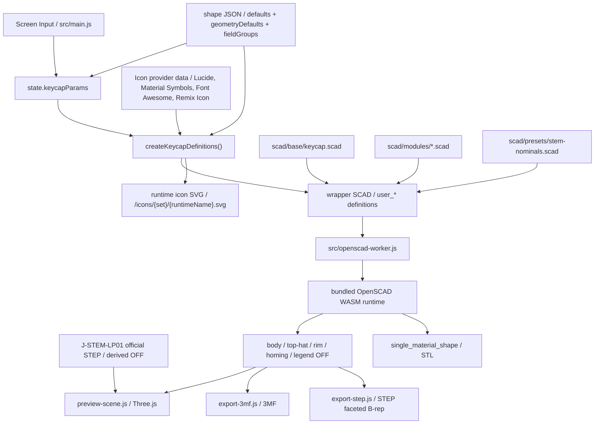

# SCAD / Export 契約

## SCAD ディレクトリの責務

- `scad/base/`
  whole-key のエントリポイントと export 切り替え
- `scad/modules/`
  shell、legend、stem、homing bar などの再利用部品
- `scad/presets/`
  SCAD 固有の nominal constant や sample 用 parameter set
- `scad/samples/`
  形状回帰確認に使うサンプル

## 現在のキーキャップエントリ

`scad/base/keycap.scad` が現在の基準エントリです。`export_target` で次を切り替えます。

- `preview`
- `body`
- `body_core`
- `top_hat`
- `rim`
- `homing`
- `legend`
- `top_legend_right_top`
- `top_legend_right_bottom`
- `top_legend_left_top`
- `top_legend_left_bottom`
- `side_legend_front`
- `side_legend_back`
- `side_legend_left`
- `side_legend_right`
- `single_material_shape`
- `j_stem_lp01_reference`

この構成により、preview 用表示と part 単位 export を同じ基礎形状から扱います。

## separate volume の扱い

- body / top-hat / rim / legend は別体積を維持できる
- homing bar は body 側の触覚マーカーとして扱い、legend と混ぜない
- body / top-hat / rim / legend / homing の相対位置は共有原点で揃える
- 色だけに依存せず、mesh 自体を part として分ける

## preview と export の責務分離

- preview:
  反応速度と見た目確認を優先する
- export:
  part 分離と形状の意味づけを優先する

現在の preview は OFF メッシュを body / top-hat / rim / homing / legend ごとに生成して Three.js へ渡します。top-hat は分離色が有効な場合だけ別 OFF になる。Three.js 側では shared vertex を保った indexed geometry を基準に creased normals を作り、曲面は滑らかに、急角は残す。SCAD 側の円弧分割は feature の半径と `quality` に応じて上限付きで増やす。現在の 3MF export は同じ part 群から 3MF を組み立てます。STEP export は `single_material_shape` target を OFF として出力し、ブラウザ側で STEP AP214 faceted B-rep へ変換します。STL export は `single_material_shape` target から OpenSCAD runtime の STL 出力を直接使い、色と legend を含まない単一メッシュとして扱います。

legend の `text()` は bundled OpenSCAD runtime 上で preview / export の `quality` に応じて曲線分割数を上げ、内部では拡大してから縮小する。これにより、小さい文字サイズでも丸みのある書体の輪郭が過度に角張るのを抑える。font の native style は JS 側で `font` query を組み立てて指定し、ユーザー操作なしの擬似 bold / italic / slanted は行わない。下線は font file の `post` / `head` / `hhea` から `UnderlinePosition` / `UnderlineThickness` / line box 中心を読み、`valign="center"` な text 座標へ変換したうえで実測文字幅と組み合わせる。font metadata を取れない場合の任意フォールバックは行わない。輪郭補正は `legendOutlineDelta` を通した明示入力時だけ `offset()` を使う。
legend は content type として `text` と `icon` を持つ。`text` は従来どおり font と `text()` を使い、`icon` は選択した icon provider の SVG を runtime asset として `/icons/{iconSet}/{runtimeName}.svg` に注入し、SCAD 側で `import()` した 2D 形状を `linear_extrude()` して legend volume にする。font 選択とは独立して `legendIconSet` / `legendIconName` / `legendIconFill` を保持し、既存 JSON に icon 用フィールドがない場合は `text` / `lucide` / `circle` / `false` を補完する。`legendIconFill` は選択した icon が通常 body とは異なる filled body を持つ場合だけ有効になり、Material Symbols は outline shape と base filled shape、Remix Icon は `*-line` と `*-fill` へ provider ごとに解決する。ブラウザ実行時は Lucide、Material Symbols、Font Awesome Free Solid、Remix Icon を jsDelivr の `latest` package から読み込み、取得した SVG node / body / path data を sanitizer に通してから OpenSCAD 用 SVG を作る。Lucide は sanitizer 済み node をさらに stroke primitives から filled path へ変換する。CDN が利用できない場合は installed package 由来の fallback data を同じ sanitizer / 変換経路に通す。見た目が変わらない icon では `legendIconFill` を `false` に丸め、UI も表示しない。アイコンでは provider が持つ stroke / fill の形状比率を維持し、`legendOutlineDelta` による `offset()` 太さ補正は適用しない。アイコンでも `legendSize`、`legendHeight`、位置、色は共通に扱い、下線は出さない。現在の provider は Lucide、Material Symbols、Font Awesome Free Solid、Remix Icon。
ユーザーが TTF / OTF を追加した場合、その font はブラウザ内の一時 registry に `マイフォント` として保持し、preview / export 実行時だけ runtime asset として `/fonts/user/` 配下へ注入する。編集データ JSON には font 本体を保存せず、file bytes の hash 由来の `user-font:*` key だけを保持する。同じ font file を再追加すると key が一致して復元できる。未読み込みの `user-font:*` は既定 font へ黙って置換せず、UI で再追加を促す。
legend の文字サイズは UI の `legendSize` をそのまま基準にし、文字数に応じた自動縮小や単一文字だけの自動拡大は行わない。
legend の `legendHeight` は 0 を面一とし、正値は表面から盛り上がる高さ、負値は表面から沈み込む recess 深さとして扱う。負値の場合も legend part は別体積のまま保持し、body 側は表面から recessed legend の上面までを切り抜いて表示する。
legend の作業領域はキーキャップ上面の footprint を上限にしない。文字が大きすぎる場合も自動縮小せず、SCAD 側の surface fitting 用領域を十分広く取って、legend part がキー上面からはみ出すことを許可する。
top legend の曲面追従 volume は、上面曲面とその下側へ平行移動した曲面の間の band として扱う。cylindrical / spherical の深い凹面でも高い凸面でも、平面基準の作業領域を曲面の drop / rise の両側へ広げ、legend part が空になることを避ける。

## UI から SCAD への橋渡し

OpenSCAD browser runtime では `-D` 上書きが安定しなかったため、実行ごとに wrapper SCAD を生成して `user_*` 定義を注入します。

主な橋渡しファイル:

- `src/lib/keycap-scad-bundle.js`
- `src/data/keycap-shape-registry.js`
- `src/data/keycap-shapes/*.json`
- `scad/presets/stem-nominals.scad`

The current keytop posture parameters are based on `topCenterHeight`, and normalized to `topPitchDeg` for front-to-back and `topRollDeg` for left-to-right. While edge height input can also be used in the UI, the save and SCAD bridge use this normalized representation.
`topOffsetX` / `topOffsetY` shift the center of the keytop's top surface left/right and front/back without moving the stem origin. On the SCAD side, the same XY offset is passed to the body shell, rim, legend, homing bar, and inner clearance for stem clipping, leaving the stem body at the origin.
For custom shell, the keytop top surface R is treated as a common value `topCornerRadius`, and only when `topCornerRadiusIndividualEnabled` is enabled, `topCornerRadiusLeftTop` / `topCornerRadiusRightTop` / `topCornerRadiusRightBottom` / `topCornerRadiusLeftBottom` are passed as `user_top_corner_radii`. The array order on the SCAD side is `[left_top, right_top, right_bottom, left_bottom]`.
Keytop shape is switched between `flat` / `cylindrical` / `spherical` using `topSurfaceShape`. `dishDepth` is signed, treating positive values as indentation amount and negative values as bulge amount, and the input range is rounded to `-1.5mm` to `+1.5mm` for both cylindrical and spherical. Default values are maintained at `0.5mm` for cylindrical and `1.0mm` for spherical. The start position of the curved surface is fixed based on the top footprint, and when the absolute value is changed, only the Z direction of the existing sphere / cylinder is normalized, so the positive and negative become mirror images of the same curved surface. The convex surface is not cut by the vertical wall of the nominal footprint, but cut by an envelope extending the sidewall gradient upwards starting from the actual top boundary after rounding. This prevents deforming the central cylindrical / spherical curved surface and avoids creating extra lips or flat steps at the connection with the side. Negative values bulge only the outside, keeping the inner ceiling and stem mounting height at the same position as flat.
On the SCAD side, the dish is also subjected to the same coordinate transformation as the top plane, so even if `topPitchDeg` / `topRollDeg` are changed, it can be tilted while maintaining the local shape of cylindrical / spherical.
The `topScale` of the shell shape is kept as a UI parameter, but resolved to final front-back/left-right angles from current `keyWidth` / `keyDepth` / `topCenterHeight` by the JS bridge before being passed to SCAD. Because the top footprint targets `keyWidth * topScale` and `keyDepth * topScale`, a square key shrinks while keeping its top square even if tapered. The initial value `0.75` makes the top surface about 13.5mm for an 18mm 1u key. The lower limit is basically `0.02`, and under dimensional conditions where the top footprint or inner clearance crushes to less than 0.2mm, it is rounded up in 0.01 step units on the JS side.
`keycapEdgeRadius` for custom shell and JIS Enter is treated as an R chamfer applied only to the boundary between the keytop top surface and the sidewall. 0 is the traditional sharp edge, and a positive value adds only a local roundover at the top edge while maintaining the existing shoulder generation. The convex envelope of `dishDepth` tracks this actual top boundary after roundover and does not add shape outside the R.
`keycapShoulderRadius` for custom shell and JIS Enter is applied to the shoulder cross-section tapering from the bottom surface of the keycap body to the top surface. 0 is the traditional straight sharp edge, a positive value is treated as a shoulder bulging roundly outwards, and a negative value is a shoulder recessing inwards. The maximum absolute value is rounded to the smaller of the actual horizontal taper amount determined from `topCenterHeight` and `topScale`.
Custom shell can add another small keytop on the top surface with `topHatEnabled`. The top-hat is treated as a shape on the body side by default, and is separated into a `top_hat` target only when `topHatSeparateColorEnabled` is enabled and `topHatHeight` is a positive value. Even in this case, it is integrated in `single_material_shape`. `topHatColor` is used only as the color for the `top_hat` part in preview / 3MF. `topHatSurfaceShape` / `topHatDishDepth` / `topHatTopWidth` / `topHatTopDepth` / `topHatBottomWidth` / `topHatBottomDepth` / `topHatTopRadius` / `topHatBottomRadius` / `topHatHeight` / `topHatShoulderAngle` / `topHatShoulderRadius` are passed to `user_*`. `topHatSurfaceShape` is a `flat` / `cylindrical` / `spherical` for the top-hat top surface independent of the normal `topSurfaceShape`, with the default value being `flat`. `topHatDishDepth` also treats positive values as indentation and negative values as bulge, ranging from `-1.5mm` to `+1.5mm` for cylindrical / spherical, and 0 for `flat`. `topHatTopWidth` / `topHatTopDepth` are treated as the dimensions of the top-hat top surface, and `topHatBottomWidth` / `topHatBottomDepth` as the dimensions of the top-hat bottom surface, with the bottom dimensions rounded to be greater than or equal to the top dimensions and within the parent keytop top surface. `topHatTopRadius` is treated separately as the top surface radius of the top-hat, and `topHatBottomRadius` as the bottom surface radius of the top-hat. Only when `topHatTopRadiusIndividualEnabled` is enabled, `topHatTopRadiusLeftTop` / `topHatTopRadiusRightTop` / `topHatTopRadiusRightBottom` / `topHatTopRadiusLeftBottom` are passed as `user_top_hat_top_radii`, and only when `topHatBottomRadiusIndividualEnabled` is enabled, `topHatBottomRadiusLeftTop` / `topHatBottomRadiusRightTop` / `topHatBottomRadiusRightBottom` / `topHatBottomRadiusLeftBottom` are passed as `user_top_hat_bottom_radii`. The array order on the SCAD side for both is `[left_top, right_top, right_bottom, left_bottom]`. If `topHatHeight` is negative, the same shape is recessed from the top surface and rounded to a depth that does not penetrate the shell ceiling. `topHatShoulderRadius` is 0 for a sharp edge, a positive value rounds the cross-section of the shoulder, and a negative value recesses it. Because the maximum absolute value is rounded to the smaller of the actual shoulder height and width, it can be specified up to where the cross-section viewed from the side becomes a 1/4 circular shape at 45 degrees. This is not yet displayed for typewriter styles.
The JIS Enter shape is treated as a `jis_enter` geometry type. The default values are a generally vertical Enter footprint of 1.5u x 2u, with a bottom-left notch of 0.25u x 1u, and the notch amount can be edited with `jisEnterNotchWidth` / `jisEnterNotchDepth`. Since JIS X 6002 does not specify physical keytop dimensions, this shape is treated as a preset for JIS / ISO style keycap footprints often used in practice. The typewriter style JIS Enter is defined as a `typewriter_jis_enter` geometry type, using the same JIS footprint while applying the thin top, rim, and reverse stem mount of the typewriter.
Initial values, geometry defaults, and display group configurations for each shape are located in `src/data/keycap-shapes/*.json`, and the SCAD side does not hold fail-safe defaults for top-level user parameters. The JS bridge resolves all necessary values from the shape JSON and injects them as `user_*`.

The UI's `1u` conversion standard is treated as a display and input aid for narrow pitch verification. Changing the standard value does not change model dimensions like `keyWidth` / `keyDepth`, nor does it pass them to the SCAD bridge or edit data JSON. Only when the input on the `u` side is edited, it is converted to mm dimensions using the current conversion standard and reflected in the existing model parameters.

The mounting height of the typewriter shape is held in `typewriterMountHeight` and treated as the distance from the center of the top surface of the keycap body to the bottom edge of the stem. Since the SCAD side converts `user_typewriter_mount_height` and `topCenterHeight` into the actual `stem_height`, `topCenterHeight` can be adjusted as the thickness of the keycap body, and `typewriterMountHeight` as the height when mounted, independently.

The stem creates the nominal shape of the desired height first, and finally uses `intersection()` with the keycap's internal clearance volume to limit it. This ensures that even with a strong `pitch / roll`, the stem automatically stops at the position hitting the back of the keycap, tracking more naturally than simple height suppression. J-STEM-LP01 is applied as a subtraction recess for receiving the LP01 top surface to the body shell / legend part / single material shape, rather than as a normal positive stem. The socket recess carves only the outer shape of the LP01 plate with 0 nominal clearance, leaving the round hole positions inside the plate without carving the back of the keycap. When switching to J-STEM-LP01 for the first time, start the UI's `stemCrossMargin` at 0.1mm based on actual physical confirmation results. If the actual part is tight, adjust the carved outer shape of the socket in 0.02mm increments in the positive direction; if loose, adjust in the negative direction. The legend is not disabled but maintains a separate volume, and only the area overlapping the socket is trimmed with the same recess. The app preview of the LP01 body displays the official STEP-derived OFF from `public/assets/j-stem-lp01/` as an alignment reference with color selection. Clear is displayed as translucent, white and orange as opaque, and it is not included in 3MF / STEP / STL. The `j_stem_lp01_reference` target and `j_stem_lp01_model()` on the SCAD side are retained as old reference models.
The correspondence between the length labels on the J-STEM-LP01 drawing and SCAD constants is summarized in [../reference/j-stem-lp01-dimensions.md](../reference/j-stem-lp01-dimensions.md).

### Flow of Screen JSON SCAD WASM in Mermaid



Rules:

- When adding UI parameters, update both `src/main.js` and `src/lib/keycap-scad-bundle.js` at the same time.
- When the geometry contract changes, update `scad/base/` or `scad/modules/`.
- Initial values and display groups for each shape are consolidated in shape JSON, and SCAD receives only explicit parameters.

## Purpose of Samples

- `scad/samples/keycap-1u.scad`
  For regression checks of the current keycap configuration.
- `scad/samples/keycap-jis-enter.scad`
  For regression checks of the vertically long JIS / ISO Enter footprint and custom shell top surface degrees of freedom.
- `scad/samples/keycap-typewriter-jis-enter.scad`
  For regression checks of the typewriter style JIS Enter footprint, rim, and mount positions.
- `scad/samples/keycap-typewriter-rim.scad`
  For checking key rim separation of typewriter shape.
- `scad/samples/keycap-typewriter-rim-tilted.scad`
  For checking joint of typewriter key rim with pitch / roll.
- `scad/samples/keycap-typewriter-mount-height.scad`
  For checking mounting height based on typewriter shape top surface.
- `scad/samples/keycap-typewriter-spherical-top.scad`
  For regression checks that spherical top does not break in typewriter shape.
- `scad/samples/keycap-legend-seat.scad`
  For checking flush legend seat cutout.
- `scad/samples/keycap-curved-legend-seat.scad`
  For regression checks that body does not cover legend surface even on spherical top.
- `scad/samples/keycap-multi-character-legend.scad`
  For regression checks that it does not auto-shrink even with multiple characters, keeping explicit size.
- `scad/samples/keycap-top-legends.scad`
  For checking center / top right / bottom right / top left / bottom left legend placement on the keycap top.
- `scad/samples/keycap-rounded-legend.scad`
  For regression checks of legend contour quality with rounded fonts.
- `scad/samples/keycap-sidewall-legend.scad`
  For checking front / back / left / right sidewall legend placement.
- `scad/samples/keycap-homing-bar.scad`
  For checking homing bar individually.
- `scad/samples/keycap-stem-clip.scad`
  For regression checks that stem top end stops along inner ceiling with strong left/right tilt.
- `scad/samples/keycap-j-stem-lp01.scad`
  For checking backside carving of J-STEM-LP01 socket.
- `scad/samples/keycap-surface-quality.scad`
  For regression checks evaluating surface quality of rounded corners, dish, and stem outer circumference together.
- `scad/samples/keycap-convex-surfaces.scad`
  For regression checks evaluating negative `dishDepth` for cylindrical/spherical shapes on 1u, wide keys, top edge radii, and JIS Enter.
- `scad/samples/keycap-top-corner-radii.scad`
  For regression checks of individual specifications for 4 corner radii on custom shell top surface.
- `scad/samples/keycap-top-orientation.scad`
  For regression checks of fixed top center height + pitch / roll.
- `scad/samples/keycap-top-offset.scad`
  For checking XY offset of keycap center while keeping stem origin fixed.
- `scad/samples/keycap-top-edge-rounded.scad`
  For checking custom shell keycap top edge radii.
- `scad/samples/keycap-shoulder-rounded.scad`
  For checking body shoulder radius of custom shell.
- `scad/samples/keycap-shoulder-rounded-hollow.scad`
  For checking tracking of rounded shoulder and inner hollow in custom shell.
- `scad/samples/keycap-shoulder-concave.scad`
  For checking negative body shoulder radius of custom shell.
- `scad/samples/keycap-top-hat.scad`
  For checking top-hat keycap of custom shell.
- `scad/samples/keycap-top-hat-separated.scad`
  For checking separate part target of top-hat in custom shell.
- `scad/samples/keycap-top-hat-spherical.scad`
  For checking spherical top-hat top surface of custom shell.
- `scad/samples/keycap-top-hat-top-radii.scad`
  For regression checks of individual specifications of top-hat top surface 4 corner radii in custom shell.
- `scad/samples/keycap-top-hat-recess.scad`
  For checking negative height top-hat recess of custom shell.
- `scad/samples/stem-mounts.scad`
  For checking stem mount differences.

Samples are currently used for geometry regression.

## Current Export Contract

### 3MF

- 出力元は OFF メッシュ
- 3MF 内では part ごとに object resource を分ける
- `build` には part 直列ではなく、body / top-hat / rim / homing / legend 系 part を `components` として束ねた親 object を 1 件だけ置く
- 親 object の `name` には UI の `名称` を使う
- 現在の part 候補は `body`、`top-hat`、`rim`、`homing`、`legend`、`legend-left-top`、`legend-right-top`、`legend-left-bottom`、`legend-right-bottom`、`legend-front`、`legend-back`、`legend-left`、`legend-right`
- top-hat 分離色が無効、または top-hat が凹み形状の場合、`top-hat` object は含まれない
- キートップ legend が無効なら対応する `legend*` object は含まれない
- sidewall legend が無効なら対応する `legend-*` object は含まれない
- text legend と icon legend はどちらも `legend*` object として扱い、3MF 内の part 分離と色指定を維持する
- typewriter key rim が無効なら rim object は含まれない
- homing bar が無効なら homing object は含まれない
- 親 object には material / color を付けず、子 part object の material / color を維持する
- Bambu Studio / OrcaSlicer 向けに `Metadata/model_settings.config`、PrusaSlicer / Slic3r PE 向けに `Metadata/Slic3r_PE_model.config` を追加し、part 表示名を `body` / `rim` / `homing` / `legend` / `legend-*` として保持する
- Cura など標準3MF中心の importer 向けには、子 object の `name` と `partnumber` を保持する

### STEP

- 出力元は `single_material_shape` target の OFF メッシュ
- bundled OpenSCAD runtime は native STEP export に対応していないため、ブラウザ側で STEP AP214 の `FACETED_BREP_SHAPE_REPRESENTATION` として生成する
- body shell、top-hat、stem、homing bar、typewriter rim を単一形状として扱う
- legend は出力に含めない
- 色、material、part 名、separate volume 情報は含めない
- 曲面は OpenSCAD が生成した faceted mesh を `POLY_LOOP` / `FACE_SURFACE` として表現するため、CAD 交換用ではあるがパラメトリックな NURBS / analytic surface ではない
- 色分けや legend が必要な場合は 3MF を使う
- 他の書き出しと同じく、ダウンロードファイル名は `params.name` を基準にする

### STL

- 出力元は `single_material_shape` target
- OpenSCAD runtime から binary STL として直接出力する
- body shell、top-hat、stem、homing bar、typewriter rim を単一メッシュとして union する
- legend は出力に含めない
- 色、material、part 名、separate volume 情報は含めない
- 色分けや legend が必要な場合は 3MF を使う
- JSON / 3MF / STEP と同じく、ダウンロードファイル名は `params.name` を基準にする

### 編集データ JSON

- UI state の保存と再読み込み用
- 保存用の canonical JSON は `schemaVersion` を持つ
- `params.name` に保存名を含める
- geometry export ではなく、作業再開用フォーマットとして扱う
- JSON / 3MF / STEP / STL のダウンロードファイル名は `params.name` を基準にする
- 保存時は shape defaults を解決したフル設定を保持し、非活性 UI の値も落とさない
- 読み込み時は canonical JSON に加えて sparse な互換入力 JSON も受ける
- 互換入力 JSON は `params` 配下または top-level に既知パラメータを書ける。欠損したキーは shape defaults を使う
- `shapeProfile` が明示されていればその defaults を基準に bind し、未指定なら既定 profile を使う
- 未知のキーは無視し、既知キーだけを sanitize して state へ反映する

互換入力 JSON の最小例:

```json
{
  "shapeProfile": "typewriter",
  "legendText": "ESC",
  "rimEnabled": false
}
```

上の例では `rimWidth` や `legendColor` など未指定の値を typewriter の shape JSON defaults で補完したうえで、最終的な editor state を復元する。

## 現在の既知制約

- legend はキートップ上の中央 / 右上 / 右下 / 左上 / 左下と sidewall front / back / left / right の固定モデル
- キートップ legend の露出面は top dish 前提
- sidewall legend は各側面の中央基準面の傾きに合わせて配置し、壁の内側面まで自動で埋め込む。角丸や JIS Enter の欠き込み面へは自動追従しない
- font asset は variable / static の混在を許容するが、native style の有無は font ごとに異なる
- ユーザー追加の TTF / OTF はブラウザ内のマイフォントとして扱い、JSON / project ZIP には font 本体を同梱しない
- `high_preview` のような追加品質段階は未採用。必要になったら [../backlog/high-preview-quality-mode.md](../backlog/high-preview-quality-mode.md) を起点に再検討する

これらの拡張 TODO は [../backlog/legend-extensibility-todo.md](../backlog/legend-extensibility-todo.md) にまとめる。

## 更新ルール

- SCAD の責務境界が変わったらこの文書を更新する
- export の part 契約が変わったらこの文書と手動確認手順を更新する
- 採用判断は [../decisions/decision-log.md](../decisions/decision-log.md) に残す
