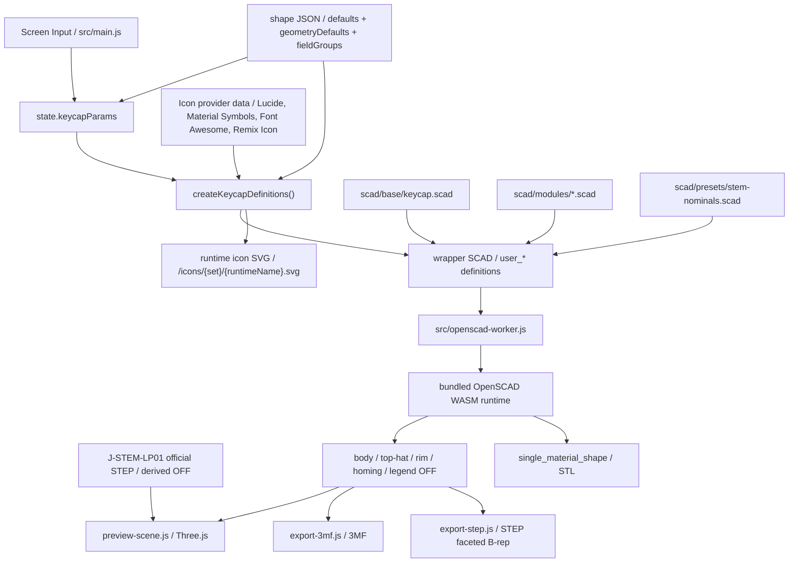

# SCAD and Export Contract

## SCAD Directory Responsibilities

- `scad/base/`
  Whole-key entry point and export switching
- `scad/modules/`
  Reusable parts such as shell, legend, stem, and homing bar
- `scad/presets/`
  SCAD-specific nominal constants and parameter sets for samples
- `scad/samples/`
  Samples used for shape regression checks

## Current Keycap Entry

`scad/base/keycap.scad` is the current base entry. The following are switched by `export_target`:

- `preview`
- `body`
- `body_core`
- `top_hat`
- `rim`
- `homing`
- `legend`
- `top_legend_right_top`
- `top_legend_right_bottom`
- `top_legend_left_top`
- `top_legend_left_bottom`
- `side_legend_front`
- `side_legend_back`
- `side_legend_left`
- `side_legend_right`
- `single_material_shape`
- `j_stem_lp01_reference`

With this structure, preview display and part-by-part export are handled from the same base shape.

## Handling Separate Volumes

- Body / top-hat / rim / legend can maintain separate volumes
- Homing bar is treated as a tactile marker on the body side, not mixed with legends
- Relative positions of body / top-hat / rim / legend / homing are aligned to a shared origin
- Instead of relying solely on colors, the meshes themselves are separated into parts

## Separation of Responsibilities Between Preview and Export

- Preview:
  Prioritizes response speed and visual confirmation
- Export:
  Prioritizes part separation and the meaning of shapes

The current preview generates OFF meshes per body / top-hat / rim / homing / legend and passes them to Three.js. The top-hat becomes a separate OFF only when separation coloring is enabled. On the Three.js side, creased normals are created based on indexed geometry retaining shared vertices, keeping curved surfaces smooth while preserving sharp edges. Arc divisions on the SCAD side increase based on feature radius and `quality`, up to a limit. The current 3MF export assembles 3MFs from the same set of parts. STEP export outputs the `single_material_shape` target as OFF and converts it to STEP AP214 faceted B-rep on the browser side. STL export directly uses the STL output of the OpenSCAD runtime from the `single_material_shape` target, treated as a single mesh without color and legends.

Legend's `text()` increases curve divisions depending on `quality` for preview/export on the bundled OpenSCAD runtime, internally expanding and shrinking. This prevents rounded typeface contours from becoming excessively angular even at small sizes. Native font styles are specified by assembling a `font` query in JS; no pseudo-bold / italic / slanted is applied without user action. Underlines read `UnderlinePosition` / `UnderlineThickness` / line box center from the font file's `post` / `head` / `hhea` tables, convert to `valign="center"` text coordinates, and combine with actual measured text width. No arbitrary fallbacks are used if font metadata is unavailable. Contour correction uses `offset()` only upon explicit input via `legendOutlineDelta`.
Legends have content types of `text` and `icon`. `text` uses fonts and `text()` as usual; `icon` injects the SVG of the selected icon provider as a runtime asset to `/icons/{iconSet}/{runtimeName}.svg`, and uses `linear_extrude()` on the SCAD side after `import()`ing the 2D shape. `legendIconSet` / `legendIconName` / `legendIconFill` are held independently of font selection. If existing JSONs lack icon fields, `text` / `lucide` / `circle` / `false` are supplemented. `legendIconFill` is enabled only when the selected icon has a filled body distinct from the normal body. Material Symbols resolves to outline shape and base filled shape, and Remix Icon resolves to `*-line` and `*-fill` per provider. During browser execution, Lucide, Material Symbols, Font Awesome Free Solid, and Remix Icon are loaded from jsDelivr's `latest` packages. The fetched SVG node / body / path data goes through a sanitizer before making the SVG for OpenSCAD. Lucide further converts sanitized nodes from stroke primitives to filled paths. If the CDN is unavailable, fallback data from installed packages goes through the same sanitizer/conversion path. For icons whose appearance does not change, `legendIconFill` is rounded to `false`, and the UI is hidden. Icons maintain their provider's stroke / fill shape ratios, and `offset()` thickness correction via `legendOutlineDelta` is not applied. Icons share `legendSize`, `legendHeight`, position, and color settings, but do not show underlines. Current providers are Lucide, Material Symbols, Font Awesome Free Solid, and Remix Icon.
If a user adds a TTF / OTF, that font is held in the in-browser temporary registry as `My Fonts`, and injected as a runtime asset under `/fonts/user/` only during preview/export execution. Font data itself is not saved in edit data JSONs; only the `user-font:*` key derived from the file bytes' hash is kept. Re-adding the same font file matches the key and restores it. Unloaded `user-font:*` keys are not silently replaced with default fonts; the UI prompts re-addition.
Legend text size uses the UI's `legendSize` as the baseline; it is not auto-shrunk based on character count or auto-enlarged for single characters.
`legendHeight` treats 0 as flush. Positive values mean protruding height from the surface; negative values mean recessed depth sinking from the surface. Even for negative values, the legend part retains its separate volume, and the body side is displayed cut out from the surface down to the top face of the recessed legend.
Legend workspace is not capped by the keycap top footprint. Even if text is too large, it doesn't auto-shrink. The surface fitting area on the SCAD side is made large enough, allowing legend parts to overhang the keytop.
Top legend curve tracking volume acts as a band between the top curve surface and a surface translated downwards. Even on deeply concave or highly convex cylindrical/spherical surfaces, the plane-based workspace expands to both sides of the curve drop/rise, avoiding empty legend parts.

## Bridging from UI to SCAD

Because `-D` overwrites were unstable in the OpenSCAD browser runtime, a wrapper SCAD is generated for each execution to inject `user_*` definitions.

Main bridge files:

- `src/lib/keycap-scad-bundle.js`
- `src/data/keycap-shape-registry.js`
- `src/data/keycap-shapes/*.json`
- `scad/presets/stem-nominals.scad`

The current keytop posture parameters are based on `topCenterHeight`, and normalized to `topPitchDeg` for front-to-back and `topRollDeg` for left-to-right. While edge height input can also be used in the UI, the save and SCAD bridge use this normalized representation.
`topOffsetX` / `topOffsetY` shift the center of the keytop's top surface left/right and front/back without moving the stem origin. On the SCAD side, the same XY offset is passed to the body shell, rim, legend, homing bar, and inner clearance for stem clipping, leaving the stem body at the origin.
For custom shell, the keytop top surface R is treated as a common value `topCornerRadius`, and only when `topCornerRadiusIndividualEnabled` is enabled, `topCornerRadiusLeftTop` / `topCornerRadiusRightTop` / `topCornerRadiusRightBottom` / `topCornerRadiusLeftBottom` are passed as `user_top_corner_radii`. The array order on the SCAD side is `[left_top, right_top, right_bottom, left_bottom]`.
Keytop shape is switched between `flat` / `cylindrical` / `spherical` using `topSurfaceShape`. `dishDepth` is signed, treating positive values as indentation amount and negative values as bulge amount, and the input range is rounded to `-1.5mm` to `+1.5mm` for both cylindrical and spherical. Default values are maintained at `0.5mm` for cylindrical and `1.0mm` for spherical. The start position of the curved surface is fixed based on the top footprint, and when the absolute value is changed, only the Z direction of the existing sphere / cylinder is normalized, so the positive and negative become mirror images of the same curved surface. The convex surface is not cut by the vertical wall of the nominal footprint, but cut by an envelope extending the sidewall gradient upwards starting from the actual top boundary after rounding. This prevents deforming the central cylindrical / spherical curved surface and avoids creating extra lips or flat steps at the connection with the side. Negative values bulge only the outside, keeping the inner ceiling and stem mounting height at the same position as flat.
On the SCAD side, the dish is also subjected to the same coordinate transformation as the top plane, so even if `topPitchDeg` / `topRollDeg` are changed, it can be tilted while maintaining the local shape of cylindrical / spherical.
The `topScale` of the shell shape is kept as a UI parameter, but resolved to final front-back/left-right angles from current `keyWidth` / `keyDepth` / `topCenterHeight` by the JS bridge before being passed to SCAD. Because the top footprint targets `keyWidth * topScale` and `keyDepth * topScale`, a square key shrinks while keeping its top square even if tapered. The initial value `0.75` makes the top surface about 13.5mm for an 18mm 1u key. The lower limit is basically `0.02`, and under dimensional conditions where the top footprint or inner clearance crushes to less than 0.2mm, it is rounded up in 0.01 step units on the JS side.
`keycapEdgeRadius` for custom shell and JIS Enter is treated as an R chamfer applied only to the boundary between the keytop top surface and the sidewall. 0 is the traditional sharp edge, and a positive value adds only a local roundover at the top edge while maintaining the existing shoulder generation. The convex envelope of `dishDepth` tracks this actual top boundary after roundover and does not add shape outside the R.
`keycapShoulderRadius` for custom shell and JIS Enter is applied to the shoulder cross-section tapering from the bottom surface of the keycap body to the top surface. 0 is the traditional straight sharp edge, a positive value is treated as a shoulder bulging roundly outwards, and a negative value is a shoulder recessing inwards. The maximum absolute value is rounded to the smaller of the actual horizontal taper amount determined from `topCenterHeight` and `topScale`.
Custom shell can add another small keytop on the top surface with `topHatEnabled`. The top-hat is treated as a shape on the body side by default, and is separated into a `top_hat` target only when `topHatSeparateColorEnabled` is enabled and `topHatHeight` is a positive value. Even in this case, it is integrated in `single_material_shape`. `topHatColor` is used only as the color for the `top_hat` part in preview / 3MF. `topHatSurfaceShape` / `topHatDishDepth` / `topHatTopWidth` / `topHatTopDepth` / `topHatBottomWidth` / `topHatBottomDepth` / `topHatTopRadius` / `topHatBottomRadius` / `topHatHeight` / `topHatShoulderAngle` / `topHatShoulderRadius` are passed to `user_*`. `topHatSurfaceShape` is a `flat` / `cylindrical` / `spherical` for the top-hat top surface independent of the normal `topSurfaceShape`, with the default value being `flat`. `topHatDishDepth` also treats positive values as indentation and negative values as bulge, ranging from `-1.5mm` to `+1.5mm` for cylindrical / spherical, and 0 for `flat`. `topHatTopWidth` / `topHatTopDepth` are treated as the dimensions of the top-hat top surface, and `topHatBottomWidth` / `topHatBottomDepth` as the dimensions of the top-hat bottom surface, with the bottom dimensions rounded to be greater than or equal to the top dimensions and within the parent keytop top surface. `topHatTopRadius` is treated separately as the top surface radius of the top-hat, and `topHatBottomRadius` as the bottom surface radius of the top-hat. Only when `topHatTopRadiusIndividualEnabled` is enabled, `topHatTopRadiusLeftTop` / `topHatTopRadiusRightTop` / `topHatTopRadiusRightBottom` / `topHatTopRadiusLeftBottom` are passed as `user_top_hat_top_radii`, and only when `topHatBottomRadiusIndividualEnabled` is enabled, `topHatBottomRadiusLeftTop` / `topHatBottomRadiusRightTop` / `topHatBottomRadiusRightBottom` / `topHatBottomRadiusLeftBottom` are passed as `user_top_hat_bottom_radii`. The array order on the SCAD side for both is `[left_top, right_top, right_bottom, left_bottom]`. If `topHatHeight` is negative, the same shape is recessed from the top surface and rounded to a depth that does not penetrate the shell ceiling. `topHatShoulderRadius` is 0 for a sharp edge, a positive value rounds the cross-section of the shoulder, and a negative value recesses it. Because the maximum absolute value is rounded to the smaller of the actual shoulder height and width, it can be specified up to where the cross-section viewed from the side becomes a 1/4 circular shape at 45 degrees. This is not yet displayed for typewriter styles.
The JIS Enter shape is treated as a `jis_enter` geometry type. The default values are a generally vertical Enter footprint of 1.5u x 2u, with a bottom-left notch of 0.25u x 1u, and the notch amount can be edited with `jisEnterNotchWidth` / `jisEnterNotchDepth`. Since JIS X 6002 does not specify physical keytop dimensions, this shape is treated as a preset for JIS / ISO style keycap footprints often used in practice. The typewriter style JIS Enter is defined as a `typewriter_jis_enter` geometry type, using the same JIS footprint while applying the thin top, rim, and reverse stem mount of the typewriter.
Initial values, geometry defaults, and display group configurations for each shape are located in `src/data/keycap-shapes/*.json`, and the SCAD side does not hold fail-safe defaults for top-level user parameters. The JS bridge resolves all necessary values from the shape JSON and injects them as `user_*`.

The UI's `1u` conversion standard is treated as a display and input aid for narrow pitch verification. Changing the standard value does not change model dimensions like `keyWidth` / `keyDepth`, nor does it pass them to the SCAD bridge or edit data JSON. Only when the input on the `u` side is edited, it is converted to mm dimensions using the current conversion standard and reflected in the existing model parameters.

The mounting height of the typewriter shape is held in `typewriterMountHeight` and treated as the distance from the center of the top surface of the keycap body to the bottom edge of the stem. Since the SCAD side converts `user_typewriter_mount_height` and `topCenterHeight` into the actual `stem_height`, `topCenterHeight` can be adjusted as the thickness of the keycap body, and `typewriterMountHeight` as the height when mounted, independently.

The stem creates the nominal shape of the desired height first, and finally uses `intersection()` with the keycap's internal clearance volume to limit it. This ensures that even with a strong `pitch / roll`, the stem automatically stops at the position hitting the back of the keycap, tracking more naturally than simple height suppression. J-STEM-LP01 is applied as a subtraction recess for receiving the LP01 top surface to the body shell / legend part / single material shape, rather than as a normal positive stem. The socket recess carves only the outer shape of the LP01 plate with 0 nominal clearance, leaving the round hole positions inside the plate without carving the back of the keycap. When switching to J-STEM-LP01 for the first time, start the UI's `stemCrossMargin` at 0.1mm based on actual physical confirmation results. If the actual part is tight, adjust the carved outer shape of the socket in 0.02mm increments in the positive direction; if loose, adjust in the negative direction. The legend is not disabled but maintains a separate volume, and only the area overlapping the socket is trimmed with the same recess. The app preview of the LP01 body displays the official STEP-derived OFF from `public/assets/j-stem-lp01/` as an alignment reference with color selection. Clear is displayed as translucent, white and orange as opaque, and it is not included in 3MF / STEP / STL. The `j_stem_lp01_reference` target and `j_stem_lp01_model()` on the SCAD side are retained as old reference models.
The correspondence between the length labels on the J-STEM-LP01 drawing and SCAD constants is summarized in [../reference/j-stem-lp01-dimensions.md](../reference/j-stem-lp01-dimensions.md).

### Flow of Screen JSON SCAD WASM in Mermaid



Rules:

- When adding UI parameters, update both `src/main.js` and `src/lib/keycap-scad-bundle.js` at the same time.
- When the geometry contract changes, update `scad/base/` or `scad/modules/`.
- Initial values and display groups for each shape are consolidated in shape JSON, and SCAD receives only explicit parameters.

## Purpose of Samples

- `scad/samples/keycap-1u.scad`
  For regression checks of the current keycap configuration.
- `scad/samples/keycap-jis-enter.scad`
  For regression checks of the vertically long JIS / ISO Enter footprint and custom shell top surface degrees of freedom.
- `scad/samples/keycap-typewriter-jis-enter.scad`
  For regression checks of the typewriter style JIS Enter footprint, rim, and mount positions.
- `scad/samples/keycap-typewriter-rim.scad`
  For checking key rim separation of typewriter shape.
- `scad/samples/keycap-typewriter-rim-tilted.scad`
  For checking joint of typewriter key rim with pitch / roll.
- `scad/samples/keycap-typewriter-mount-height.scad`
  For checking mounting height based on typewriter shape top surface.
- `scad/samples/keycap-typewriter-spherical-top.scad`
  For regression checks that spherical top does not break in typewriter shape.
- `scad/samples/keycap-legend-seat.scad`
  For checking flush legend seat cutout.
- `scad/samples/keycap-curved-legend-seat.scad`
  For regression checks that body does not cover legend surface even on spherical top.
- `scad/samples/keycap-multi-character-legend.scad`
  For regression checks that it does not auto-shrink even with multiple characters, keeping explicit size.
- `scad/samples/keycap-top-legends.scad`
  For checking center / top right / bottom right / top left / bottom left legend placement on the keycap top.
- `scad/samples/keycap-rounded-legend.scad`
  For regression checks of legend contour quality with rounded fonts.
- `scad/samples/keycap-sidewall-legend.scad`
  For checking front / back / left / right sidewall legend placement.
- `scad/samples/keycap-homing-bar.scad`
  For checking homing bar individually.
- `scad/samples/keycap-stem-clip.scad`
  For regression checks that stem top end stops along inner ceiling with strong left/right tilt.
- `scad/samples/keycap-j-stem-lp01.scad`
  For checking backside carving of J-STEM-LP01 socket.
- `scad/samples/keycap-surface-quality.scad`
  For regression checks evaluating surface quality of rounded corners, dish, and stem outer circumference together.
- `scad/samples/keycap-convex-surfaces.scad`
  For regression checks evaluating negative `dishDepth` for cylindrical/spherical shapes on 1u, wide keys, top edge radii, and JIS Enter.
- `scad/samples/keycap-top-corner-radii.scad`
  For regression checks of individual specifications for 4 corner radii on custom shell top surface.
- `scad/samples/keycap-top-orientation.scad`
  For regression checks of fixed top center height + pitch / roll.
- `scad/samples/keycap-top-offset.scad`
  For checking XY offset of keycap center while keeping stem origin fixed.
- `scad/samples/keycap-top-edge-rounded.scad`
  For checking custom shell keycap top edge radii.
- `scad/samples/keycap-shoulder-rounded.scad`
  For checking body shoulder radius of custom shell.
- `scad/samples/keycap-shoulder-rounded-hollow.scad`
  For checking tracking of rounded shoulder and inner hollow in custom shell.
- `scad/samples/keycap-shoulder-concave.scad`
  For checking negative body shoulder radius of custom shell.
- `scad/samples/keycap-top-hat.scad`
  For checking top-hat keycap of custom shell.
- `scad/samples/keycap-top-hat-separated.scad`
  For checking separate part target of top-hat in custom shell.
- `scad/samples/keycap-top-hat-spherical.scad`
  For checking spherical top-hat top surface of custom shell.
- `scad/samples/keycap-top-hat-top-radii.scad`
  For regression checks of individual specifications of top-hat top surface 4 corner radii in custom shell.
- `scad/samples/keycap-top-hat-recess.scad`
  For checking negative height top-hat recess of custom shell.
- `scad/samples/stem-mounts.scad`
  For checking stem mount differences.

Samples are currently used for geometry regression checks.

## Current Export Contract

### 3MF

- Source is OFF mesh
- Object resources are separated for each part within 3MF
- In `build`, instead of placing parts sequentially, parts related to body / top-hat / rim / homing / legend are bundled as a parent object using `components`, and only one parent object is placed
- Parent object `name` uses `Name` from UI
- Current candidate parts are `body`, `top-hat`, `rim`, `homing`, `legend`, `legend-left-top`, `legend-right-top`, `legend-left-bottom`, `legend-right-bottom`, `legend-front`, `legend-back`, `legend-left`, `legend-right`
- If top-hat separation color is disabled or top-hat is recessed, `top-hat` object is not included
- If top legend is disabled, the corresponding `legend*` objects are not included
- If sidewall legend is disabled, the corresponding `legend-*` objects are not included
- Both text legends and icon legends are treated as `legend*` objects, maintaining part separation and color specification in 3MF
- If typewriter key rim is disabled, rim object is not included
- If homing bar is disabled, homing object is not included
- Parent object does not have material/color; child part objects retain their material/color
- Adds `Metadata/model_settings.config` for Bambu Studio/OrcaSlicer, and `Metadata/Slic3r_PE_model.config` for PrusaSlicer/Slic3r PE, retaining part display names as `body` / `rim` / `homing` / `legend` / `legend-*`
- Maintains child object `name` and `partnumber` for standard 3MF-oriented importers like Cura

### STEP

- Source is OFF mesh of `single_material_shape` target
- Since bundled OpenSCAD runtime doesn't support native STEP export, browser generates it as `FACETED_BREP_SHAPE_REPRESENTATION` of STEP AP214
- Body shell, top-hat, stem, homing bar, and typewriter rim are treated as a single shape
- Legends are not included in the output
- Color, material, part name, and separate volume information are not included
- Curved surfaces represent faceted mesh generated by OpenSCAD as `POLY_LOOP` / `FACE_SURFACE`. Though for CAD exchange, it's not a parametric NURBS / analytic surface
- Use 3MF if color separation or legend is needed
- As with other exports, download file name is based on `params.name`

### STL

- Source is `single_material_shape` target
- Exported directly as binary STL from OpenSCAD runtime
- Body shell, top-hat, stem, homing bar, and typewriter rim are combined (union) into a single mesh
- Legends are not included in the output
- Color, material, part name, and separate volume information are not included
- Use 3MF if color separation or legend is needed
- As with JSON / 3MF / STEP, download file name is based on `params.name`

### Edit Data JSON

- For saving and reloading UI state
- Canonical JSON for saving has `schemaVersion`
- Includes save name in `params.name`
- Treated as a format for resuming work, not geometry export
- JSON / 3MF / STEP / STL download file names are based on `params.name`
- When saving, it holds full configuration resolving shape defaults, without dropping values for disabled UI inputs
- When loading, accepts sparse compatible input JSON in addition to canonical JSON
- Compatible input JSON can have known parameters under `params` or top-level. Missing keys fall back to shape defaults
- If `shapeProfile` is explicit, binds relative to its defaults; if unspecified, uses default profile
- Ignores unknown keys and sanitizes only known keys to reflect in state

Minimal example of compatible input JSON:

```json
{
  "shapeProfile": "typewriter",
  "legendText": "ESC",
  "rimEnabled": false
}
```

In the example above, unspecified values like `rimWidth` or `legendColor` are populated with typewriter shape JSON defaults before restoring the final editor state.

## Current Known Constraints

- Legends are fixed models of center / top right / bottom right / top left / bottom left on the keytop and sidewall front / back / left / right
- Top legend exposure assumes top dish
- Sidewall legends align with the inclination of the center reference plane of each side, and embed automatically up to the inner surface of the wall. They do not automatically track rounded corners or notched surfaces of JIS Enter
- Font assets allow a mix of variable / static, but the availability of native styles varies per font
- User-added TTF / OTF are treated as local browser fonts, and the font files are not bundled in JSON / project ZIP
- Additional quality levels like `high_preview` are not yet adopted. Re-evaluate from `docs/backlog/high-preview-quality-mode.md` if needed

These extension TODOs are documented in `docs/backlog/legend-extensibility-todo.md`.

## Update Rules

- Update this document when SCAD responsibility boundaries change
- Update this document and the manual verification procedure when the export part contract changes
- Leave adoption decisions in `docs/decisions/decision-log.md`
